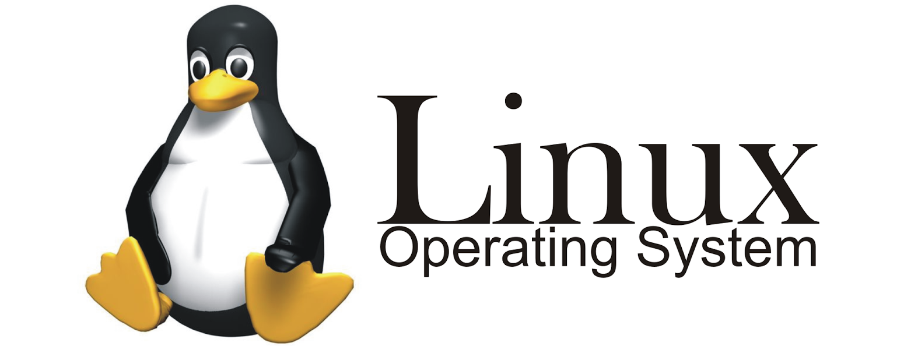

# syllabus

**CMP 337 Linux**

**Course Objectives:**

1. To provide a strong knowledge of the open-source operating system.
2. To provide knowledge of the server program in the operating system.

***

#### Course Contents:

**Unit I: Introduction 2 hours**

1. Linux:
   * History
   * Introduction
2. Advantages of Linux over other operating systems
3. FAT, NTFS, EXT
4. Culture of free software

**Unit II: Basics of Linux 5 hours**

1. Commands
2. Shells:
   * Csh
   * Ksh
   * Bash
3. Text Editors:
   * Vim
   * Pico
4. The file system of Linux
5. Directories and their special purpose

**Unit III: Installation of Linux 3 hours**

1. Partitioning
2. Installation of Linux
3. Troubleshooting of installation

**Unit IV: System Administration 6 hours**

1. Root login
2. Superuser
3. Configuration of hardware with kudzu
4. Checking system space
5. Monitoring system performance
6. Working with a file system
7. Configuring modules

**Unit V: User Management 6 hours**

1. Creating user accounts
2. Setting user defaults
3. Providing support to users
4. Modifying accounts
5. Deleting user accounts
6. Checking disk quotas
7. Sending mail to all users

**Unit VI: Security and System Handling 6 hours**

1. Understanding shell scripts
2. System startup and shutdown
3. Scheduling system tasks
4. Backing up and restoring
5. Password protection
6. File security

**Unit VII: Setting up a Web Server 4 hours**

1. Introduction to a web server
2. Starting the Apache web server
3. Configuring the Apache web server
4. Monitoring server activities

**Unit VIII: Setting up DHCP and NIS 5 hours**

1. Introduction to DHCP
2. Setting up a DHCP server
3. Setting up DHCP client
4. Understand NIS

**Unit IX: Setting up a Database Server 5 hours**

1. Configuring database server
2. Checking the status
3. Working with database

**Unit X: Setting up DNS Server 4 hours**

1. Introduction to DNS
2. Setting up DNS and > configuration
3. Querying DNS

**Unit XI: ISP Simulation 2 hours**

1. Integration of servers
2. DNS, Web, Email, etc.

**List of Practical:**

1. Linux utilities
2. OS installation project work
3. User management using a terminal
4. Security level access control list
5. Network setting
6. Server configuration of DHCP, DNS, Database server
7. Demonstration of the web, mail, file server.

**Text Book:**

1. Christopher Negus: Red Hat Linux 8.0, Bible, WILEY

**Reference Books:**

1. Neil Jankins and Stanschat: Understanding Local Area Networks, PHI
2. Andrew S. Tanenbaum: Computer Networks, PHI
