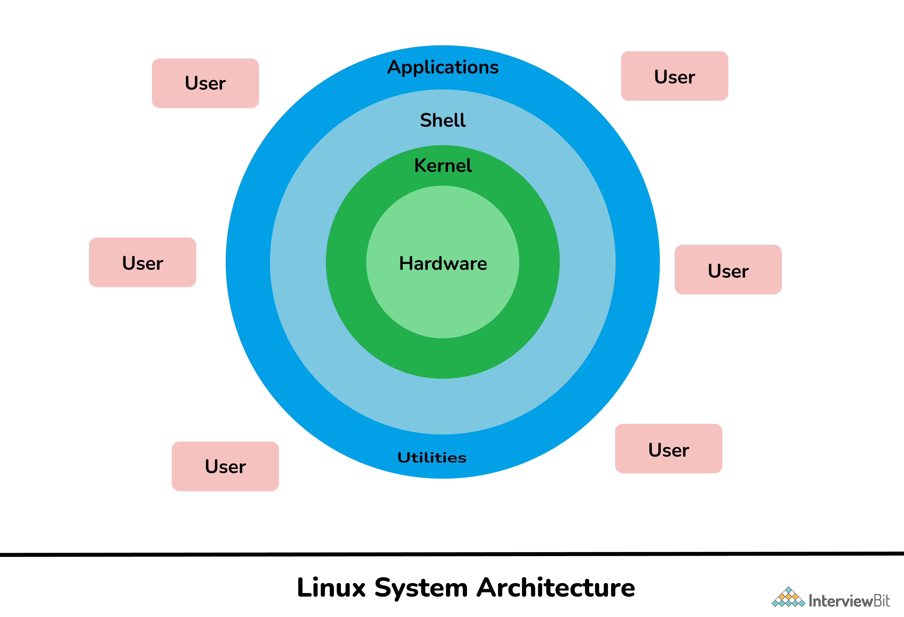

## 1. What is Linux? Is it legal to edit Linux kernel? Is Linux operating system virus free? Explain.

Linux is an open-source Unix-like operating system kernel that serves as the core component of many popular operating systems. Developed by Linus Torvalds in 1991, Linux was created as a free and open-source alternative to proprietary operating systems. The kernel itself manages hardware resources and provides essential services to run software applications.

It's important to note that when people refer to "Linux," they are often referring to a complete operating system distribution that includes the Linux kernel along with a collection of software, libraries, and utilities. These complete distributions, such as Ubuntu, Fedora, and Debian, combine the Linux kernel with various software packages to create functional operating systems.

Yes, it is legal to edit the Linux kernel and make modifications to it. In fact, one of the fundamental principles of open-source software, which includes the Linux kernel, is the ability to access, modify, and distribute the source code. This concept is protected by open-source licenses like the GNU General Public License (GPL).

The GPL, which covers the Linux kernel, grants users the following rights:

1. **Freedom to use:** You can run the Linux kernel on your computer or device without any restrictions.

2. **Freedom to study:** You can examine the source code of the Linux kernel to understand how it works.

3. **Freedom to modify:** You are allowed to make changes to the Linux kernel's source code to suit your needs or preferences.

4. **Freedom to distribute:** You can share your modified version of the Linux kernel with others, as long as you adhere to the terms of the GPL.

However, if you distribute a modified version of the Linux kernel, you must also make the source code of your modifications available to others under the same GPL license. This ensures that the principles of open source, which include transparency and collaboration, are preserved.

Linux is not immune to malware, but it tends to have a significantly lower risk of viruses and malware compared to some other operating systems like Windows. Several factors contribute to Linux's relatively lower vulnerability to malware:

1. **Open Source Nature:** The open-source nature of Linux allows a large and active community of developers to continuously review and improve the code. This makes it harder for malicious code to go unnoticed.

2. **Limited Privileges:** Linux, by default, enforces strict user privileges and access controls. Regular users do not have administrative (root) access by default, making it more challenging for malware to gain control of the entire system.

3. **Package Management:** Linux distributions typically have robust package management systems that provide a centralized and secure way to install software. Packages are signed with digital signatures to verify their authenticity.

4. **User Awareness:** Linux users often have a higher level of awareness regarding security practices, such as not running untrusted software as root and being cautious with the use of sudo (superuser) privileges.

5. **Market Share:** Linux has a smaller desktop market share compared to Windows, making it a less attractive target for malware developers who often aim for the widest possible impact.

While Linux is generally more secure, it is not immune to security vulnerabilities and threats. Regular software updates and good security practices are still essential to keep a Linux system secure. Users should also exercise caution when downloading and installing software from untrusted sources to mitigate potential risks.

## 2. Why Linux operating system is so popular? Differentiate between open source software and freeware.
Linux is a popular operating system for several reasons, including its open-source nature, stability, security, flexibility, and the vibrant communities that support it. Here are some key factors that contribute to Linux's popularity:

1. **Open Source Philosophy:** Linux is built on the principles of open source software, which means its source code is freely available for anyone to view, modify, and distribute. This encourages collaboration and innovation from a global community of developers and contributors.

2. **Stability and Reliability:** Linux is known for its stability and reliability. It often powers critical infrastructure and servers, where downtime can be costly. The robust architecture and well-tested codebase contribute to this reputation.

3. **Security:** Linux is inherently more secure due to its user privilege model and the open-source community's vigilance in identifying and patching vulnerabilities. Additionally, Linux distributions receive regular security updates, further enhancing security.

4. **Flexibility and Customizability:** Linux offers a high degree of flexibility and customization. Users can choose from a wide range of desktop environments, software packages, and configurations to tailor their system to their specific needs.

5. **Wide Variety of Distributions:** There are numerous Linux distributions (distros) available, each with its own focus and target audience. Whether you need a lightweight, user-friendly desktop system like Ubuntu or a highly customizable, server-centric distribution like Debian, there is a Linux distro to suit your needs.

6. **Community Support:** The Linux community is vast and helpful. Users can find support, documentation, and forums to troubleshoot issues and seek advice. This strong sense of community fosters a collaborative and supportive environment.

7. **Cost:** Linux is often free to use, and many Linux distributions and software applications are available without any cost. This cost-effectiveness is particularly appealing to individuals and organizations.

| **Aspect**                        | **Open Source Software**           | **Freeware**                       |
|-----------------------------------|-----------------------------------|------------------------------------|
| **Source Code Access**           | Available, allowing users to view, modify, and distribute it. | May not be accessible. Users typically receive compiled, executable versions of the software. |
| **Freedom**                       | Users have the freedom to use, study, modify, and distribute the software, subject to the terms of open-source licenses. | Users are free to use the software without charge but may lack the freedom to modify or distribute it. |
| **Licensing**                     | Governed by open-source licenses like the GNU General Public License (GPL), which require derivative works to be open source. | Often distributed under proprietary licenses that restrict modification and redistribution. |
| **Community Collaboration**       | Active communities of contributors and users often collaborate to improve the software. | May or may not have active communities of contributors or users working on development. |
| **Commercial Interests**          | Typically driven by a community of volunteers and non-profit organizations with no direct profit motive. | May be provided by a company for free, often for promotional purposes or to gain market share. |
| **Examples**                      | Linux, Apache web server, Mozilla Firefox browser, LibreOffice office suite, etc. | Adobe Acrobat Reader, Skype, WinRAR, etc. |

## 3. “IT is running on cloud and cloud is running on Linux.” Justify the statement.

The statement "IT is running on cloud, and cloud is running on Linux" highlights the significant role that Linux plays in the modern cloud computing infrastructure. Let's justify this statement by explaining why Linux is so crucial in the context of cloud computing:

1. **Foundation of Cloud Infrastructure:**
   - Many of the world's leading cloud service providers, such as Amazon Web Services (AWS), Google Cloud Platform (GCP), and Microsoft Azure, rely heavily on Linux to power their cloud servers and data centers.
   - Linux serves as the underlying operating system for the physical servers and virtual machines that make up the cloud infrastructure. It provides the necessary services to manage hardware resources, networking, and storage.

2. **Open Source and Cost-Effective:**
   - Linux's open-source nature makes it an attractive choice for cloud providers because they can customize and optimize it to meet their specific needs.
   - It's cost-effective for cloud providers because they don't have to pay licensing fees associated with proprietary operating systems. This cost savings can be passed on to customers.

3. **Scalability and Performance:**
   - Linux is known for its scalability and ability to handle a wide range of workloads. Cloud providers leverage Linux to create virtualized environments that can quickly scale up or down based on demand.
   - Linux also performs well in terms of resource efficiency, which is crucial for maximizing the utilization of hardware resources in a data center.

4. **Security and Stability:**
   - Linux is renowned for its security features and reliability, making it a suitable choice for hosting critical applications and data in the cloud.
   - Cloud providers can take advantage of Linux's robust security mechanisms and implement additional security measures to protect customer data.

5. **Containerization and Orchestration:**
   - Linux-based container technologies like Docker and container orchestration platforms like Kubernetes have become integral to modern cloud infrastructure.
   - Containers allow for the efficient deployment of applications, and Linux provides the foundation for containerization.

6. **Compatibility and Ecosystem:**
   - Linux supports a vast ecosystem of software and tools that are essential for cloud computing, such as web servers, databases, scripting languages, and development frameworks.
   - Compatibility with Linux ensures that a wide range of applications and services can be hosted in the cloud environment.

7. **Community Support and Innovation:**
   - The large and active Linux community continuously develops and improves the operating system, addressing security vulnerabilities and adding new features.
   - Cloud providers benefit from this community-driven innovation and can incorporate the latest advancements into their cloud offerings.

**8. Lightweight Nature:**
   - Linux is celebrated for its lightweight characteristics, which make it an excellent choice for cloud infrastructure. Its minimal resource footprint allows cloud providers to maximize hardware utilization, running multiple virtual machines (VMs) or containers on a single physical server without excessive overhead.
   - This lightweight nature contributes to cost savings by reducing the hardware requirements for cloud data centers, leading to improved energy efficiency and a smaller physical footprint.
   - Moreover, in cloud environments where efficiency and scalability are paramount, Linux's ability to efficiently allocate and manage resources is a key factor in its widespread adoption as the preferred operating system for cloud deployments.

 Linux is deeply ingrained in the fabric of cloud computing. It serves as the foundation upon which cloud infrastructure is built, providing the essential components for scalability, performance, security, and cost-effectiveness. This strong relationship between Linux and cloud computing reinforces the statement that "IT is running on cloud, and cloud is running on Linux."

## 4. How does open source becomes famous? Write the advantages of Linux over other operating system.

Open-source software can become famous or widely recognized through various mechanisms and characteristics that distinguish it from proprietary software. Here are some factors that contribute to the fame and popularity of open-source projects:

1. **Community Engagement:** Active and passionate communities of developers, contributors, and users are often the driving force behind open-source projects. These communities work together to improve the software, offer support, and promote its adoption.

2. **Transparency:** Open source promotes transparency by providing access to the source code. This transparency fosters trust, allows users to verify the security and functionality of the software, and encourages collaboration.

3. **Collaboration:** Open-source projects often benefit from a global network of contributors who collaborate on development. This diversity of perspectives and expertise can lead to rapid innovation and robust software.

4. **Cost-Efficiency:** Open-source software is often available at no cost, making it accessible to a wide range of users and organizations. This affordability can attract attention and adoption.

5. **Flexibility and Customization:** Users can customize open-source software to meet their specific needs, which is especially valuable for businesses and organizations with unique requirements.

6. **Compatibility:** Many open-source projects aim for compatibility and interoperability with other software and standards, reducing vendor lock-in and promoting broader adoption.

7. **Longevity:** Open-source projects tend to have longer lifespans because the source code is available to a wider community. This can provide assurance to users that the software will remain supported and updated.

8. **Global Impact:** Open-source projects often address global challenges, making them relevant and attractive to a broad audience. For example, open-source solutions in healthcare, education, and disaster response have gained fame for their societal impact.

**Advantages of Linux Over Other Operating Systems:**

Linux offers several advantages over other operating systems, which contribute to its popularity and widespread use in various domains:

1. **Open Source:** Linux is open source, meaning its source code is freely available for anyone to view, modify, and distribute. This promotes transparency, collaboration, and innovation.

2. **Security:** Linux is known for its robust security features, including user privilege separation, strict access controls, and regular security updates. It is less susceptible to malware and vulnerabilities compared to some other operating systems.

3. **Stability and Reliability:** Linux is renowned for its stability and uptime. It is commonly used in critical infrastructure, servers, and high-availability systems where reliability is essential.

4. **Customizability:** Linux allows users to customize their systems to meet specific needs. With numerous distributions available, users can choose one that aligns with their requirements and preferences.

5. **Resource Efficiency:** Linux can run efficiently on a wide range of hardware, including older and less powerful machines, making it suitable for resource-constrained devices and environments.

6. **Large Software Ecosystem:** Linux has a vast and diverse ecosystem of software, including server applications, development tools, and desktop environments, providing options for various use cases.

7. **Community Support:** The Linux community is vast and supportive. Users can find extensive documentation, forums, and online communities to seek help and share knowledge.

8. **Cost-Effective:** Linux is often available for free, reducing licensing costs for individuals and organizations. This cost-effectiveness is particularly attractive for businesses and educational institutions.

9. **Scalability:** Linux is highly scalable and can adapt to different workloads, from embedded systems and personal computers to large data centers and cloud infrastructure.

10. **Global Usage:** Linux is widely used in diverse fields, including web hosting, cloud computing, scientific research, and mobile devices, contributing to its global impact and recognition.

## 5. Explain the Linux with its architecture. What are the different Linux distribution? Explain any two.

Linux is a Unix-like operating system kernel that forms the core of various Linux distributions, commonly referred to as Linux distros. Linux was initially developed by Linus Torvalds in 1991, and since then, it has grown into a robust and versatile platform used in a wide range of computing environments.

**Architecture:**

The architecture of Linux can be broken down into several key components:

1. **Hardware:** The hardware layer consists of physical devices, such as the CPU, memory, storage, and network interface cards (NICs). These hardware components provide the resources needed to run the operating system and software applications.

2. **Kernel:** The Linux kernel is the core of the operating system. It manages hardware resources, including CPU, memory, storage devices, and peripheral devices. It provides essential services such as process management, memory management, file system management, and device drivers. The kernel communicates directly with the hardware and serves as an intermediary between the hardware and software applications.

3. **Shell:** The shell is a command-line interface (CLI) that allows users to interact with the operating system by typing commands. Popular Linux shells include Bash (Bourne Again Shell), Zsh (Z Shell), and Tcsh. The shell interprets user commands and communicates with the kernel to execute them.

4. **Utilities:** Linux provides a wide range of command-line utilities and tools for various tasks, such as file manipulation, text processing, network configuration, and system administration. These utilities are essential for managing and maintaining a Linux system.

5. **Application Software:** Application software refers to user-level programs that run on top of the operating system. These include desktop applications, server software, and web browsers. Linux supports a wide range of applications, including open-source and proprietary software.

6. **User:** The user is the person who interacts with the operating system and software applications. Users can access the system through the shell or graphical user interface (GUI) and run various commands and programs.

**Different Linux Distributions (Distros):**

There are hundreds of Linux distributions available, each with its own focus, package management system, and default software selection. Here are explanations of two well-known Linux distributions:

1. **Ubuntu:**
   - Ubuntu is one of the most popular and user-friendly Linux distributions. It is based on Debian and is known for its emphasis on ease of use and regular release cycles.
   - Package Management: Ubuntu uses the Debian package management system with the APT (Advanced Package Tool) package manager, making it easy to install and update software.
   - Desktop Environment: The default desktop environment for Ubuntu is GNOME, but there are official flavors with other desktop environments like Kubuntu (KDE), Xubuntu (Xfce), and Lubuntu (LXQt).
   - Long-Term Support (LTS): Ubuntu LTS releases are supported for five years, providing stability and security for enterprise users.

2. **Red Hat Enterprise Linux (RHEL):**
   - Red Hat Enterprise Linux is a commercial Linux distribution known for its stability and focus on the enterprise market.
   - Package Management: RHEL uses the RPM package format and the YUM (Yellowdog Updater, Modified) package manager for software management.
   - Subscriptions and Support: RHEL offers subscriptions that include support and access to certified software packages. It is widely used in data centers and server environments.
Certainly, let's expand the list of Linux distributions to include Linux distributions focused on hacking, security, and privacy:

3. **Kali Linux:**
   -  Kali Linux is a Debian-based Linux distribution specifically designed for penetration testing, ethical hacking, and digital forensics.
   -  It comes pre-installed with a wide range of security and hacking tools, making it a popular choice among cybersecurity professionals and penetration testers.
   - Kali Linux is actively maintained and regularly updated to include the latest tools and security patches.
   - It has a strong community and provides resources, tutorials, and training materials for users interested in ethical hacking and cybersecurity.

4. **Tails (The Amnesic Incognito Live System):**
   - Tails is a security-focused Linux distribution designed for privacy and anonymity. It is often used for secure and private online communication.
   - Tails is typically run as a live operating system from a USB drive or DVD, which means it doesn't leave traces on the host computer and routes internet traffic through the Tor network for anonymity.
   - Tails includes privacy-focused applications like the Tor Browser, email client, and encryption tools, making it a valuable tool for individuals seeking online privacy.
   - It is designed to leave no trace of user activity and uses secure deletion methods for files.
   - Tails prioritizes user anonymity and is used by journalists, activists, and individuals in need of secure communication and browsing.

These Linux distributions cater to different aspects of Students, DevOps, cybersecurity, ethical hacking, privacy, and anonymity.

## 6. Define term 'culture of free software'? How Linux and UNIX is related? Explain.

The "culture of free software" refers to a set of principles, values, and practices associated with the development and distribution of software that emphasizes freedom, openness, and collaboration. This culture is closely linked to the broader concept of open source software but places a strong emphasis on the fundamental freedoms that users and developers should have in relation to software. Key aspects of the culture of free software include:

1. **Freedom to Use:** Users should have the freedom to run software for any purpose, without restrictions.

2. **Freedom to Study:** Users should be able to access the source code of software, allowing them to study how it works and make modifications if desired.

3. **Freedom to Modify:** Users should have the freedom to make changes to the software's source code to suit their needs or preferences.

4. **Freedom to Distribute:** Users should be able to share the software with others, either in its original form or with modifications, under the same terms that they received it.

**Linux and UNIX Relationship:**

Linux and UNIX are closely related in terms of their operating system design and history. Here's an explanation of their relationship:

1. **Linux as a UNIX-like Operating System:**
   - Linux is often described as a "UNIX-like" operating system because it shares many design principles, concepts, and characteristics with the original UNIX operating system.
   - Linus Torvalds, the creator of Linux, was influenced by UNIX and aimed to develop a free and open-source UNIX-like operating system kernel. Hence, the Linux kernel, when combined with other software, forms a complete UNIX-like operating system.

2. **Similarities:**
   - Both Linux and UNIX adhere to the POSIX (Portable Operating System Interface) standards, which define a set of standardized APIs (Application Programming Interfaces) for compatibility and portability.
   - They both use a similar command-line interface, including shells like Bash, and have common utilities and system commands.

3. **Differences:**
   - While Linux and UNIX share many similarities, they are not the same. UNIX refers to a family of operating systems, including commercial variants like AIX, HP-UX, and Solaris, whereas Linux specifically refers to the kernel developed by Linus Torvalds and the broader ecosystem of open-source software that can be combined with it.

4. **Compatibility and Interoperability:**
   - Linux systems are designed to be compatible with many UNIX applications and commands, allowing software developed for UNIX to run on Linux with relatively few modifications.
   - Interoperability between Linux and other UNIX systems is facilitated by their adherence to common standards.

