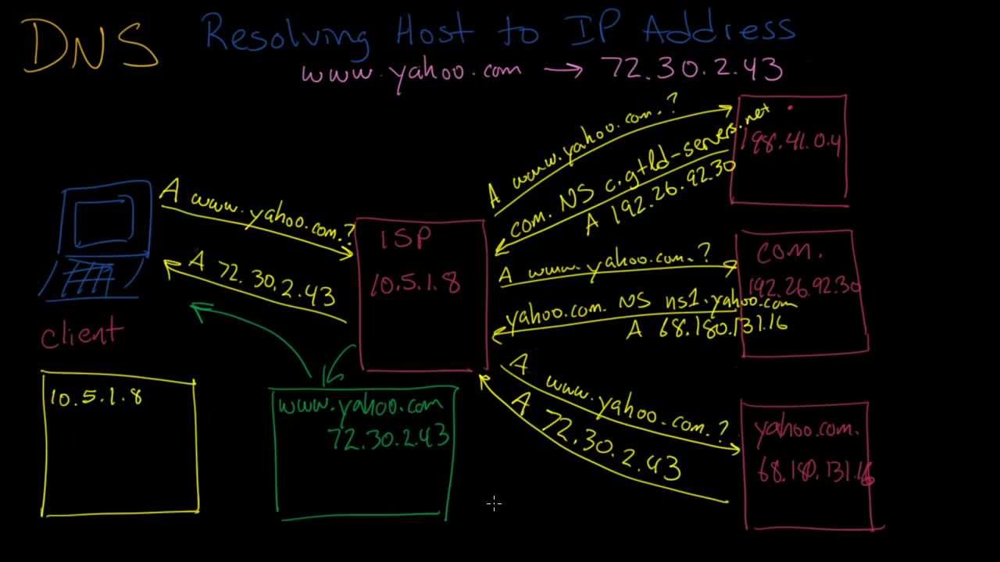
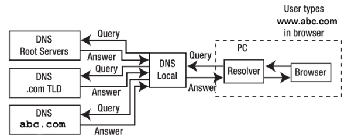

**Introduction to DNS (Domain Name System)**

The Domain Name System (DNS) is a critical component of the internet infrastructure, acting as a distributed and hierarchical system that converts human-readable domain names into IP addresses and vice versa. It enables users to access websites, send emails, and interact with internet services using user-friendly domain names, while computers and servers use IP addresses to locate each other on the internet.

**1. DNS Purpose and Importance:**

- **Name Resolution:** DNS is primarily used to map domain names (e.g., www.example.com) to IP addresses (e.g., 192.168.1.1). This translation allows users and applications to locate resources on the internet without needing to remember numerical IP addresses.

- **Internet Navigation:** DNS is crucial for users to access websites, send emails, use online services, and connect to remote servers. It simplifies internet navigation by enabling people to use human-friendly domain names.

- **Scalability:** DNS is a distributed system that can scale effectively to accommodate the vast number of domains and hosts on the internet.

**2. DNS Hierarchy and Structure:**

- **Root Domain:** At the top of the DNS hierarchy is the root domain represented by a dot (`.`). Below the root domain, there are multiple top-level domains (TLDs) such as `.com`, `.org`, `.net`, and country-code TLDs like `.uk`, `.jp`, and `.ca`.

- **Second-Level Domains:** Below the TLDs, there are second-level domains (SLDs) like `example.com`, `google.com`, and `wikipedia.org`. These domains are often registered by individuals, organizations, or entities.

- **Subdomains:** Subdomains are subdivisions of a domain, represented as `subdomain.example.com`. They allow organizations to organize their web content or services into distinct sections.

- **Fully Qualified Domain Name (FQDN):** An FQDN represents a complete domain name, including all levels of the hierarchy, from the host (e.g., www) to the top-level domain (e.g., .com). For example, `www.example.com` is an FQDN.

**3. DNS Resolution Process:**

- **DNS Resolver:** When a user enters a domain name (e.g., www.example.com) into a web browser or other application, a DNS resolver on the user's device initiates the resolution process.

- **Caching:** The resolver first checks its local cache to see if it has recently resolved the same domain. If a match is found, it returns the IP address without further queries, speeding up the process.

- **Recursive Query:** If the resolver doesn't have the IP address in its cache, it sends a recursive query to a DNS recursive resolver (usually provided by the user's internet service provider or a third-party DNS resolver).

- **Iterative Query:** The recursive resolver, if necessary, queries the root DNS servers to find the authoritative DNS servers for the top-level domain (e.g., `.com`). It then follows a chain of queries to authoritative servers until it reaches the DNS server responsible for the specific domain (e.g., `www.example.com`).
  
- **Authoritative Response:** The authoritative DNS server for the requested domain responds with the IP address, and this response is sent back up the chain to the user's DNS resolver.

- **Caching and TTL:** The resolver stores the IP address in its cache for a period specified by the Time-to-Live (TTL) value in the DNS response. Subsequent requests for the same domain can be served from the cache until the TTL expires.

**4. DNS Records:**

- DNS uses various types of resource records (RRs) to store information in the DNS database. Common DNS record types include:
  - A (Address) Record: Maps a domain name to an IPv4 address.
  - AAAA (IPv6 Address) Record: Maps a domain name to an IPv6 address.
  - CNAME (Canonical Name) Record: Creates an alias or pointer from one domain name to another.
  - MX (Mail Exchanger) Record: Specifies mail servers responsible for receiving email for a domain.
  - TXT (Text) Record: Stores arbitrary text and is often used for verification and security purposes.

**5. DNS Security:**

- **DNSSEC (DNS Security Extensions):** DNSSEC is a suite of extensions that adds an additional layer of security to DNS. It helps prevent various types of attacks, including DNS cache poisoning and man-in-the-middle attacks, by adding cryptographic signatures to DNS data.

- **DNS Filtering:** DNS can be used for filtering unwanted content, such as blocking access to malicious websites or content that violates policies. This is often done using DNS-based content filtering or blacklists.

**6. DNS Resolution Speed and Efficiency:**

- To improve DNS resolution speed, DNS resolvers often employ caching to store frequently requested DNS records.
- Content Delivery Networks (CDNs) use DNS to route users to the nearest server location for faster content delivery.

**7. Managed DNS Services:**

- Many organizations and websites use managed DNS services or domain registrars to handle DNS management and hosting, ensuring high availability and reliability.
