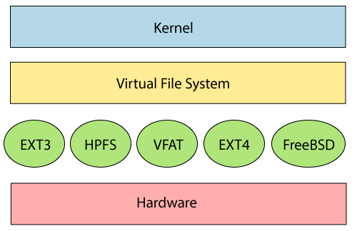
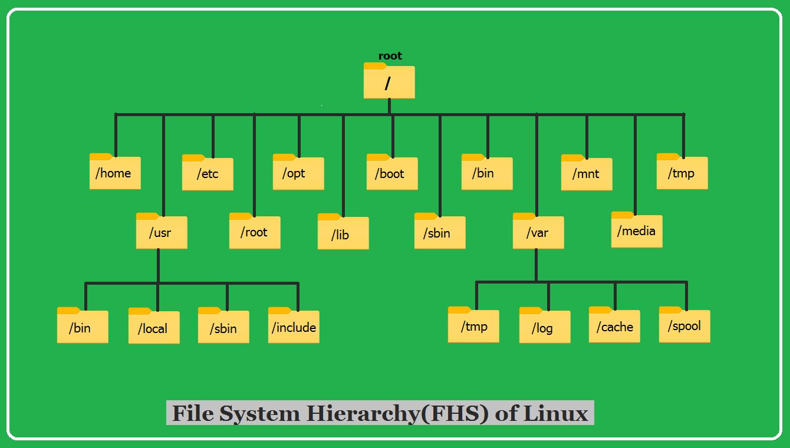

## Linux File System Structure

Linux file system has a hierarchal file structure as it contains a root directory and its subdirectories. All other directories can be accessed from the root directory. A partition usually has only one file system, but it may have more than one file system.

A file system is designed in a way so that it can manage and provide space for non-volatile storage data. All file systems required a namespace that is a naming and organizational methodology. The namespace defines the naming process, length of the file name, or a subset of characters that can be used for the file name. It also defines the logical structure of files on a memory segment, such as the use of directories for organizing the specific files. Once a namespace is described, a Metadata description must be defined for that particular file.

The data structure needs to support a hierarchical directory structure; this structure is used to describe the available and used disk space for a particular block. It also has the other details about the files such as file size, date & time of creation, update, and last modified.

Also, it stores advanced information about the section of the disk, such as partitions and volumes.

The advanced data and the structures that it represents contain the information about the file system stored on the drive; it is distinct and independent of the file system metadata.Linux file system contains two-part file system software implementation architecture. Consider the below image:

The file system requires an API (Application programming interface) to access the function calls to interact with file system components like files and directories. API facilitates tasks such as creating, deleting, and copying the files. It facilitates an algorithm that defines the arrangement of files on a file system.

The first two parts of the given file system together called a Linux virtual file system. It provides a single set of commands for the kernel and developers to access the file system. This virtual file system requires the specific system driver to give an interface to the file system.

The file system in Linux is a critical component of the operating system that manages how files and directories are organized and stored on storage devices, such as hard drives and solid-state drives. Linux employs a hierarchical directory structure, which means that files and directories are organized in a tree-like fashion. Let's explore the key aspects of the Linux file system in detail:

**1. Hierarchical Directory Structure:**

- Linux follows a hierarchical or tree-like directory structure, with the root directory (`/`) at the top. All files and directories are organized under the root directory.
- Directories can contain both files and subdirectories, forming a nested structure.

**2. Root Directory (/):**

- The root directory is the top-level directory in the file system hierarchy.
- It is represented by a forward slash `/` and is the starting point for all file paths in Linux.

**3. Standard Directories:**

- Linux defines several standard directories with specific purposes. Some of the most common ones include:
  - `/bin`: Contains essential system binaries (executable files) required for system boot and repair.
  - `/etc`: Stores system-wide configuration files.
  - `/home`: Home directories for user accounts.
  - `/lib` and `/lib64`: Libraries required for programs and system functions.
  - `/usr`: Contains user binaries, libraries, and documentation.
  - `/var`: Variable data, such as logs and spool files.
  - `/tmp`: Temporary files.
  - `/dev`: Device files, representing hardware devices.
  - `/mnt` and `/media`: Mount points for removable media.

**4. File Types:**

- In Linux, everything is considered a file. This includes regular files, directories, device files, and more.
- Common file types include regular files (containing data), directories (for organizing files), symbolic links (shortcuts to other files or directories), and device files (representing hardware devices).

**5. File Permissions:**

- Linux uses a robust permission system to control who can access and modify files and directories.
- Each file and directory has associated permissions for the owner, group, and others (world). Permissions can be set to read, write, and execute for each of these categories.
- File ownership and permissions are essential for security and access control.

**6. Mount Points:**

- In Linux, storage devices are attached to the file system through mount points.
- When a device is mounted, its contents become accessible within the directory specified as the mount point.
- This allows Linux to manage various storage devices, including hard drives, USB drives, and network shares, seamlessly.

**7. Filesystem Types:**

- Linux supports various filesystem types, such as Ext4, Ext3, XFS, and Btrfs.
- The choice of filesystem type depends on factors like performance, reliability, and use case.

**8. Virtual Filesystems:**

- Linux also features virtual filesystems, such as `/proc` and `/sys`, which provide access to kernel and hardware information.
- `/proc` contains information about running processes and system configuration.
- `/sys` exposes information and configuration options related to hardware and devices.

**9. Filesystem Hierarchy Standard (FHS):**

- The Filesystem Hierarchy Standard is a set of guidelines and practices for maintaining a consistent directory structure across Linux distributions. It helps ensure compatibility and ease of use across different systems.

**10. Filesystem Commands:**

- Users and administrators interact with the file system using commands like `ls` (list files and directories), `cd` (change directory), `mkdir` (create directory), `touch` (create files), and many others.

## Linux File System Features

In Linux, the file system creates a tree structure. All the files are arranged as a tree and its branches. The topmost directory called the root (/) directory. All other directories in Linux can be accessed from the root directory.
Some key features of Linux file system are as following:

**Specifying paths:** Linux does not use the backslash (\) to separate the components; it uses forward slash (/) as an alternative. For example, as in Windows, the data may be stored in C:\ My Documents\ Work, whereas, in Linux, it would be stored in /home/ My Document/ Work.
**Partition, Directories, and Drives:** Linux does not use drive letters to organize the drive as Windows does. In Linux, we cannot tell whether we are addressing a partition, a network device, or an "ordinary" directory and a Drive.
**Case Sensitivity:** Linux file system is case sensitive. It distinguishes between lowercase and uppercase file names. Such as, there is a difference between test.txt and Test.txt in Linux. This rule is also applied for directories and Linux commands.
**File Extensions:** In Linux, a file may have the extension '.txt,' but it is not necessary that a file should have a file extension. While working with Shell, it creates some problems for the beginners to differentiate between files and directories. If we use the graphical file manager, it symbolizes the files and folders.
**Hidden files:** Linux distinguishes between standard files and hidden files, mostly the configuration files are hidden in Linux OS. Usually, we don't need to access or read the hidden files. The hidden files in Linux are represented by a dot (.) before the file name (e.g., .ignore). To access the files, we need to change the view in the file manager or need to use a specific command in the shell.

## Types of Linux File System

When we install the Linux operating system, Linux offers many file systems such as **Ext**, **Ext2**, **Ext3**, **Ext4**, **JFS**, **ReiserFS**, **XFS**, **btrfs**, and **swap**.

Let's understand each of these file systems in detail:

1. **Ext, Ext2, Ext3 and Ext4 file system**

The file system Ext stands for **Extended File System**. It was primarily developed for **MINIX OS**. The Ext file system is an older version, and is no longer used due to some limitations.

**Ext2** is the first Linux file system that allows managing two terabytes of data. Ext3 is developed through Ext2; it is an upgraded version of Ext2 and contains backward compatibility. The major drawback of Ext3 is that it does not support servers because this file system does not support file recovery and disk snapshot.

**Ext4** file system is the faster file system among all the Ext file systems. It is a very compatible option for the SSD (solid-state drive) disks, and it is the default file system in Linux distribution.

2. **JFS File System**
   JFS stands for **Journaled File System**, and it is developed by **IBM for AIX Unix**. It is an alternative to the Ext file system. It can also be used in place of Ext4, where stability is needed with few resources. It is a handy file system when CPU power is limited.

3. **ReiserFS File System**
   ReiserFS is an alternative to the Ext3 file system. It has improved performance and advanced features. In the earlier time, the ReiserFS was used as the default file system in SUSE Linux, but later it has changed some policies, so SUSE returned to Ext3. This file system dynamically supports the file extension, but it has some drawbacks in performance.

4. **XFS File System**
   XFS file system was considered as high-speed JFS, which is developed for parallel I/O processing. NASA still using this file system with its high storage server (300+ Terabyte server).

5. **Btrfs File System**
   Btrfs stands for the **B tree file system**. It is used for fault tolerance, repair system, fun administration, extensive storage configuration, and more. It is not a good suit for the production system.

6. **Swap File System**
   The swap file system is used for memory paging in Linux operating system during the system hibernation. A system that never goes in hibernate state is required to have swap space equal to its RAM size.

## What is Mounting in the Linux Filesystem?

In Linux, the `"to mount"`, a filesystem term, refers to the initial days of computing when a removable disk or tape pack would physically need to be mounted on a correct drive device. On the disk pack, the filesystem would logically be mounted by the OS to make contents available to access by application programs, OS, and users after being located on the drive physically.

Simply, a mount point is a directory that's made as a component of the filesystem. For instance, the home filesystem is placed on the /home directory. Filesystems can be placed on mount points on many non-root filesystems, but it's less common.

- The root filesystem of Linux is mounted on the / directory (root directory) very early inside the boot sequence.
- Several filesystems are later mounted by the start-up programs of Linux, either rc upon SystemV or via systemd in new Linux versions.
- Filesystem mounting during startup is handled by the configuration file, i.e., `/etc/fstab`.
- An easy way to understand that is fstab is short for `"file system table"`, and it's a filesystem list that is to be mounted, their options, and designated mount points that may be required for particular filesystems.
  Filesystems can be mounted on an available mount point/directory with the help of the mount command. In other words, any directory that's applied as a mount point shouldn't have other files in it and should be empty. Linux will not avoid users from mounting a filesystem on one that's already available or on a directory that includes files. The actual contents will be covered, and just the freshly mounted filesystem content will be visible if we mount any filesystem on any existing filesystem or directory.

