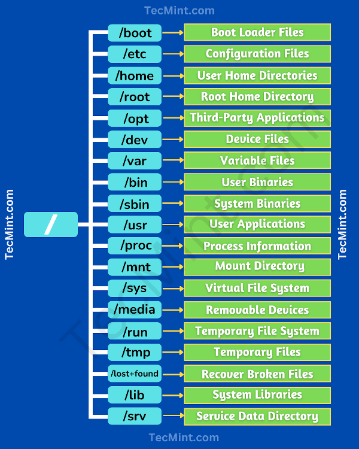

Directories in a file system, including those in Linux, are containers used to organize and manage files and other directories. They play a critical role in maintaining the hierarchical structure of the file system and facilitating efficient data storage and retrieval. In addition to general directories for file organization, Linux also includes several special-purpose directories that serve specific functions:

**1. **General Directories:** 
These directories are used for organizing and storing user and system files.

   - **/home:** Home directories for individual user accounts. Each user typically has a subdirectory here for their files and personal configurations.

   - **/etc:** Contains system-wide configuration files and settings for various software applications and services.

   - **/var:** Stores variable data files, such as logs, spool files, and temporary data generated by system processes.

   - **/tmp:** Used for temporary files that are typically deleted upon system reboot.

   - **/bin and /usr/bin:** Contain essential system binaries (executable files) that are required for basic system operations. `/bin` contains binaries necessary for system recovery.

   - **/lib, /lib64 and /usr/lib:** House libraries required by programs and system functions.
   
   - **/root:** The home directory for the root user.

**2. Special-Purpose Directories:** 
These directories serve specific functions in the Linux file system:

   - **/proc:** A virtual directory that provides a view of the system's running processes and kernel parameters. It contains information about each running process and is used for process management.

   - **/sys:** Another virtual directory that exposes information and configuration options related to hardware and devices. It is commonly used for managing hardware settings and querying hardware-related data.

   - **/dev:** Contains device files representing hardware devices, including disks, terminals, and input/output devices. These files serve as interfaces for communicating with hardware devices.

   - **/boot:** Contains the Linux kernel and related boot loader files. This directory is essential for system booting and recovery.

   - **/mnt and /media:** Used as mount points for mounting external storage devices, such as USB drives, CD/DVD-ROMs, and network shares.

   - **/srv:** Reserved for data files that are served by the system, typically for services like web servers or FTP servers.

   - **/lost+found:** A directory used by the filesystem repair tool (fsck) to store recovered files after a system crash.

   - **/run:** Contains runtime data files created and managed by various system processes during system operation.

   - **/opt:** Typically used for optional software packages installed by the system administrator.

