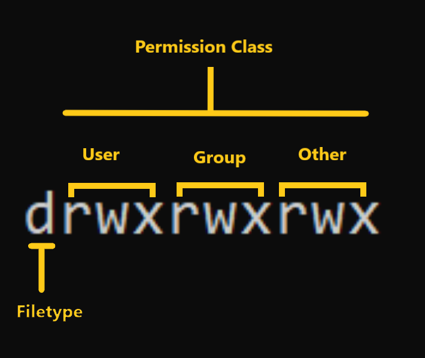
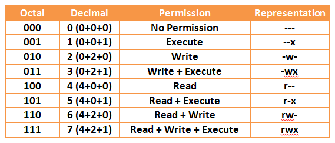

Linux file permissions are essential for controlling access to files and directories, ensuring the security and integrity of the system. Users and administrators must understand how to set, view, and modify permissions to manage file access effectively.
Linux file permissions are a crucial aspect of the operating system's security model. They determine who can access, modify, and execute files and directories on a Linux system. File permissions are primarily defined for three categories: the owner of the file, the group associated with the file, and others (everyone else). 


## File Permission Categories:

1. **Owner (User):** The user who owns the file or directory. This user has the most control over the file, including the ability to change its permissions.

2. **Group:** Files and directories can be associated with a specific group. All users belonging to that group share the group's permissions for that file.

3. **Others (World):** Everyone else who is not the owner or a member of the group falls into this category.

**File Permissions:**

Linux file permissions are represented using a combination of letters and symbols:

- `r`: Read permission (can view the file's contents or list directory contents).
- `w`: Write permission (can modify or delete the file or create new files in a directory).
- `x`: Execute permission (can run a program or script if it is marked as executable).

These permissions are assigned to each category (owner, group, others) for each file or directory.

**Permission Settings:**

File permission settings are often displayed in the following format:

```
-rw-r--r--
```

In this example, the file has the following permissions:
- The owner has read (`r`) and write (`w`) permissions.
- The group has read (`r`) permission.
- Others have read (`r`) permission.

**Numeric Representation:**

File permissions can also be represented numerically using octal (base-8) values:

- `4` corresponds to read (`r`) permission.
- `2` corresponds to write (`w`) permission.
- `1` corresponds to execute (`x`) permission.

Using numeric representation, you can set permissions for each category (owner, group, others) and combine them to create a three-digit number. For example:

- `644` represents `-rw-r--r--` (Owner can read and write, group and others can only read).
- `755` represents `-rwxr-xr-x` (Owner can read, write, and execute; group and others can read and execute).

**Changing File Permissions:**

You can change file permissions using the `chmod` command. For example, to give the owner write permission on a file, you can use:

```
chmod u+w filename
```

## File Ownership:

Linux also assigns an owner and group to each file and directory. You can view ownership using the `ls -l` command. To change ownership, use the `chown` command, and to change group ownership, use `chgrp`.


**File Permission Table:**

Here's a table representing the file permission settings:

| Permission | Symbol | Numeric Value |
|------------|--------|---------------|
| Read       | `r`    | 4             |
| Write      | `w`    | 2             |
| Execute    | `x`    | 1             |

**Example Permissions:**

| Permission Settings | Owner | Group | Others |
|---------------------|-------|-------|--------|
| `-rw-r--r--`       |   4   |   4   |   4    |
| `-rwxr-xr-x`       |   7   |   5   |   5    |
| `drwxr-x---`       |   7   |   5   |   0    |


In the permission string `drwxr-x---`, the first letter, "d" stands for "directory." It indicates that the entry to which these permissions apply is a directory. The "d" is a special character that distinguishes directories from regular files in a Linux file listing.


If you don't use the "d" and only have the permission string like `rwxr-x---` it would be interpreted as permissions for a regular file, not a directory. In other words, it would indicate that the file has the following permissions:

The owner can read, write, and execute.
Members of the group can read and execute.
Others (world) have no permissions (cannot read, write, or execute).

Including the "d" is essential to convey that these permissions are meant for a directory. This distinction is crucial because directories and regular files serve different purposes and have different operations associated with them. For example:
- Reading a directory (r permission for a directory) allows you to list its contents.
- Writing to a directory (w permission for a directory) permits you to create, delete, or rename files and subdirectories within it.
- Executing a directory (x permission for a directory) is required to change into (cd) that directory or access its contents.
- For regular files, the same "rwx" permissions control reading, writing, and executing the file itself.

