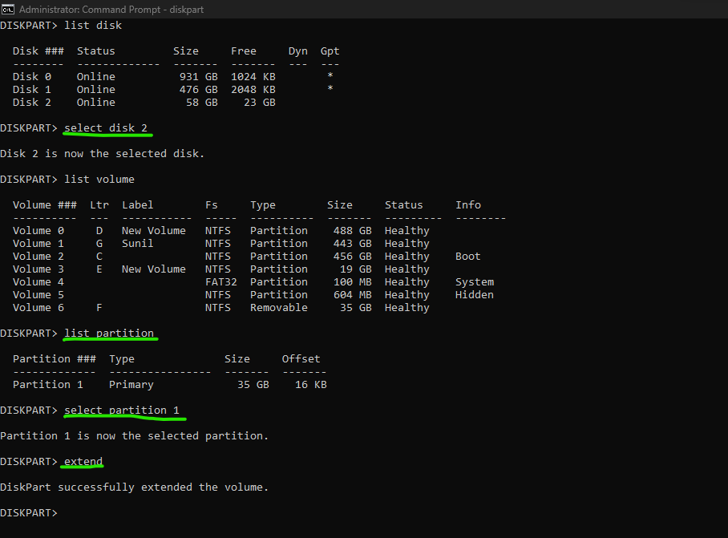

**Lets suppose we have a pendrive of 64 GB and now we have to make its 2 partition out of them first partition is of 10 GB and second partition of remaining memory**

## Windows CMD
To partition your 64 GB USB pendrive into two partitions, one with 10 GB and the remaining space as another partition using Command Prompt in administrative mode, follow these steps:

**Important: Creating or modifying partitions will erase all data on the USB drive. Make sure to back up any important data before proceeding.**

1. **Open Command Prompt as Administrator**:
   - Press `Win + X`, and select "Windows Terminal (Admin)" or "Command Prompt (Admin)" from the menu.
   - If you can't find these options, you can also search for "Command Prompt" or "cmd" in the Windows search bar, right-click on "Command Prompt," and choose "Run as administrator."

2. **Launch Diskpart**:
   - In the Command Prompt window that opens, type `diskpart` and press Enter to launch the Diskpart utility.

3. **List Disks**:
   - Type `list disk` and press Enter. This command will display a list of all the disks connected to your computer.

4. **Select the USB Drive**:
   - Identify your USB drive from the list. Note the disk number associated with your USB drive.

5. **Create the First Partition (10 GB)**:
   - Type `select disk X`, where X is the number associated with your USB drive.
   - To create the first 10 GB partition, type `create partition primary size=10000` and press Enter. This command will create a primary partition with a size of 10,000 MB (which is approximately 10 GB).

6. **Assign a Drive Letter to the First Partition** (Optional):
   - You can assign a drive letter to the first partition using the `assign letter=X` command, where X is the desired drive letter. For example, `assign letter=D` will assign the drive letter D: to the first partition.

7. **Create the Second Partition (Remaining Space)**:
   - After creating the first partition, you can create the second partition with the remaining space. Type `create partition primary` and press Enter. This will use all the remaining space on the USB drive for the second partition.

8. **Assign a Drive Letter to the Second Partition** (Optional):
   - You can assign a drive letter to the second partition using the `assign letter=Y` command, where Y is the desired drive letter.

9. **Format Both Partitions**:
   - To format the first partition as NTFS, type `format fs=ntfs quick` and press Enter.
   - To format the second partition as NTFS, type `format fs=ntfs quick` and press Enter.

10. **Exit Diskpart**:
    - Type `exit` and press Enter to exit the Diskpart utility.

11. **Close Command Prompt**:
    - Type `exit` and press Enter again to close the Command Prompt.

You have now successfully created two partitions on your 64 GB USB pendrive, with one partition of 10 GB and the remaining space as another partition. You can access and use these partitions via the assigned drive letters.

## Create new volume
if you have already create partition or all your disk you can check for volumes and then shrink the volume and then create new volume.for this follow these steps:

1. **Open Command Prompt as Administrator**: First, open a Command Prompt window with administrative privileges. To do this, search for "cmd" or "Command Prompt" in the Windows search bar, right-click on it, and select "Run as administrator."

2. **Launch DiskPart**: In the Command Prompt window, type `diskpart` and press Enter. This will launch the DiskPart utility.

3. **Select the Disk**: Type `list disk` to list all available disks and their numbers. Identify the disk number associated with your USB drive. For example, if your USB drive is Disk 1, you can select it by typing `select disk 1` and pressing Enter.

4. **List the Volumes on the Selected Disk**: Type `list volume` to list all volumes on the selected disk. Make sure that Volume  is the one you want to shrink. and use the command `select volume X` (X is the volume number) to select the volume you want to shrink.

5. **Shrink the Volume**: To shrink Volume 6 by 10 GB, you can use the `shrink` command followed by the desired size in MB. In this case, 10 GB is equivalent to 10,240 MB, so you can shrink it by typing:

   ```
   shrink desired=10240
   ```

   Press Enter. DiskPart will attempt to shrink the volume by the specified amount. If there is enough space, it will create unallocated space of approximately 10 GB.

6. **Create a New Partition**: Once you have unallocated space, you can create a new partition in that space. Type the following command to create a new partition:

   ```
   create partition primary size=10240
   ```

   This will create a primary partition using the unallocated space you just created.

7. **Format the New Partition**: To format the new partition, you can use the `format` command. For example, to format it as NTFS, you can type:

   ```
   format quick fs=ntfs label="New Partition"
   ```

   You can replace "New Partition" with your desired label if needed.

8. **Assign a Drive Letter (Optional)**: If you want to assign a drive letter to the new partition, you can use the `assign` command. For example:

   ```
   assign letter=Z
   ```

   Replace "Z" with the drive letter you want to assign.

9. **Exit DiskPart**: Type `exit` to exit the DiskPart utility.

Now, you should have a new 10 GB partition created from the unallocated space on Volume 6. You can access and use it like any other drive on your system.

## Extend back to original volume


## Windows Disk Management
To create two partitions on a 64GB USB drive in Windows using the graphical user interface (GUI), you can use the built-in Disk Management utility. Here are the steps:

1. **Insert the USB Drive:** Plug your 64GB USB drive into your Windows computer.

2. **Open Disk Management:**
   - Press `Win + X` and select "Disk Management" from the menu.
   - Alternatively, right-click on the "Start" button and choose "Disk Management."

3. **Identify the USB Drive:**
   - In the Disk Management window, you'll see a list of all connected storage devices. Locate your USB drive; it should be listed as a removable disk.

4. **Shrink the Existing Partition (if applicable):**
   - If your USB drive already has a single partition occupying the entire space, you'll need to shrink it to create free space for the new partitions.
   - Right-click on the existing partition and choose "Shrink Volume."
   - Follow the on-screen instructions to specify the amount of space to shrink. This will be the size of your first partition (e.g., 10GB).

5. **Create the First Partition:**
   - After shrinking the existing partition (if needed), you should have unallocated space on the USB drive.
   - Right-click on the unallocated space and select "New Simple Volume."
   - Follow the New Simple Volume Wizard to create the first partition. Specify the size (e.g., 10GB), assign a drive letter, and choose a filesystem format (e.g., NTFS).
   - Complete the wizard to create the first partition.

6. **Create the Second Partition:**
   - After creating the first partition, you will likely have more unallocated space left on the USB drive.
   - Right-click on the unallocated space and select "New Simple Volume" again.
   - Follow the wizard to create the second partition. You can choose to use the remaining unallocated space and assign a drive letter to the partition.
   - Specify the filesystem format and complete the wizard.

7. **Finish the Process:**
   - After creating both partitions, you should see them listed in Disk Management with their respective drive letters.
   - You can now access and use your USB drive with the two partitions as separate drives in Windows.


## Red Hat Linux
You can create two partitions on your 64GB USB drive in Red Hat Linux using the `fdisk` command or the more user-friendly `gnome-disks` graphical utility. Here are the steps for both methods:

**Method 1: Using fdisk Command (Command-Line)**

1. **Open a Terminal:** Launch a terminal window on your Red Hat Linux system.

2. **Identify Your USB Drive:** Use the `lsblk` or `fdisk -l` command to list the available storage devices and identify your USB drive. It is typically listed as `/dev/sdX`, where "X" is a letter representing the drive. Ensure you identify the correct drive to avoid data loss.

3. **Partition the Drive:**
   - Run the `fdisk` command with the path to your USB drive (e.g., `/dev/sdX`).
   - Example: `sudo fdisk /dev/sdX`

4. **Create Partitions:**
   - Type `n` to create a new partition.
   - Specify the partition type (usually primary) and the starting sector for the first partition.
   - Specify the desired size for the first partition (e.g., 10GB) and create the partition.
   - Repeat the process to create the second partition, but use the default values to use the remaining space.
   - Type `w` to write the changes and exit `fdisk`.

5. **Format the Partitions:**
   - Use the `mkfs` command to format the partitions with your desired filesystem (e.g., ext4).
   - Example: `sudo mkfs -t ext4 /dev/sdX1` for the first partition and `sudo mkfs -t ext4 /dev/sdX2` for the second partition.

**Method 2: Using gnome-disks (Graphical Utility)**

1. **Open Disks Utility:** You can open the "Disks" utility using the graphical interface by pressing the Super key (Windows key), typing "Disks," and selecting the application.

2. **Select Your USB Drive:** In the Disks utility, select your USB drive from the list on the left-hand side.

3. **Create Partitions:**
   - Click the gear icon (⚙️) and select "Format Partition" to create the first partition.
   - Specify the size (e.g., 10GB) and filesystem type (e.g., ext4).
   - Click "Format."
   - Create the second partition using the same process, but this time, use the remaining space on the drive.

4. **Apply Changes:** After creating both partitions, click the "Play" button (▶️) in the upper-right corner to apply the changes.

Please exercise caution when partitioning drives, as this process can result in data loss if not performed correctly. Always back up important data before making changes to your storage devices. Additionally, be sure to use the correct device path (e.g., `/dev/sdX`) when partitioning to avoid accidentally modifying the wrong drive.
