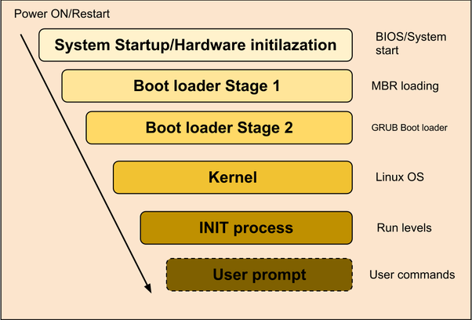
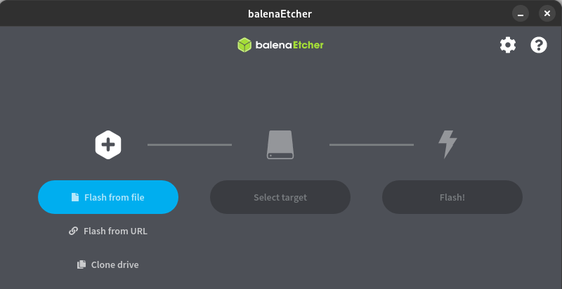
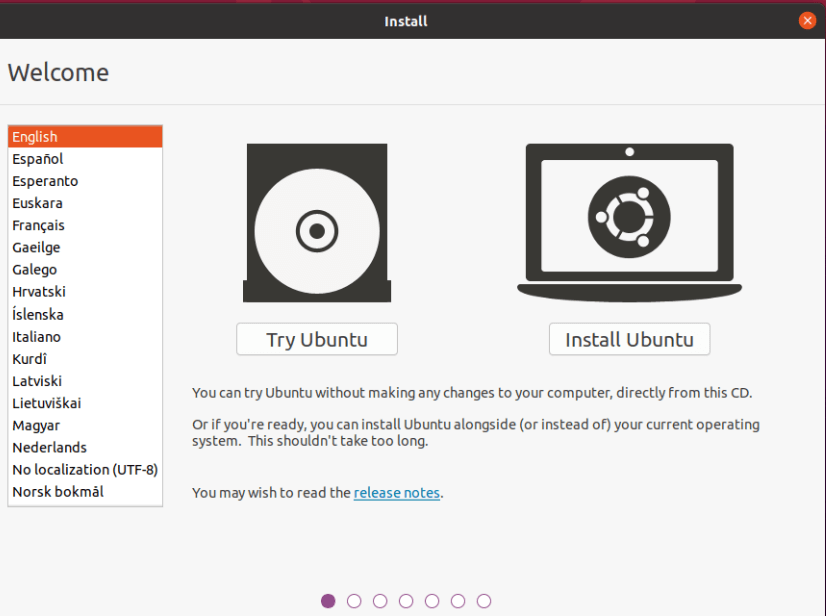
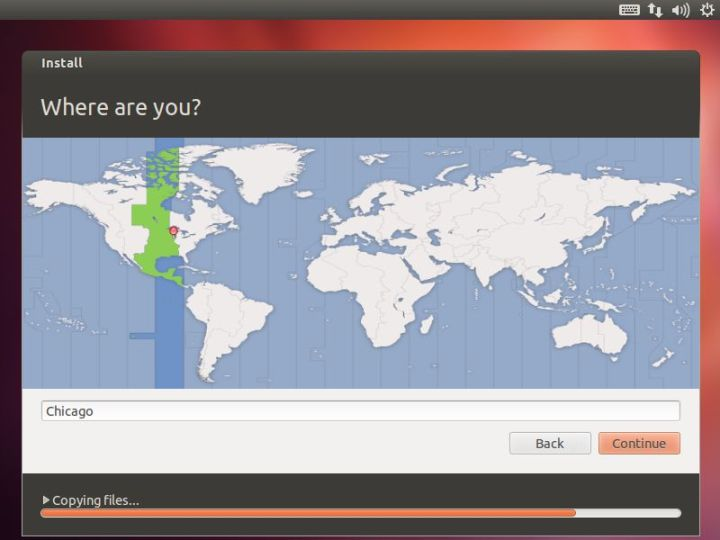
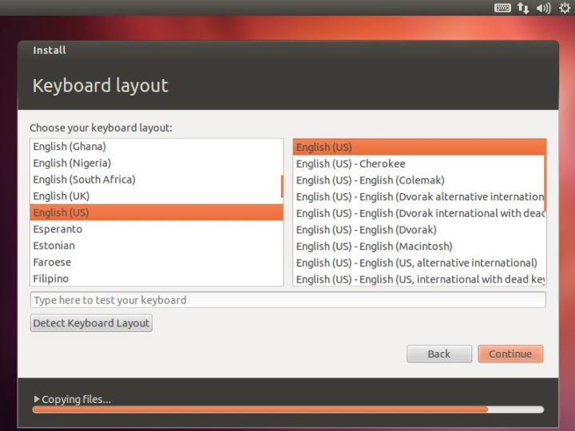
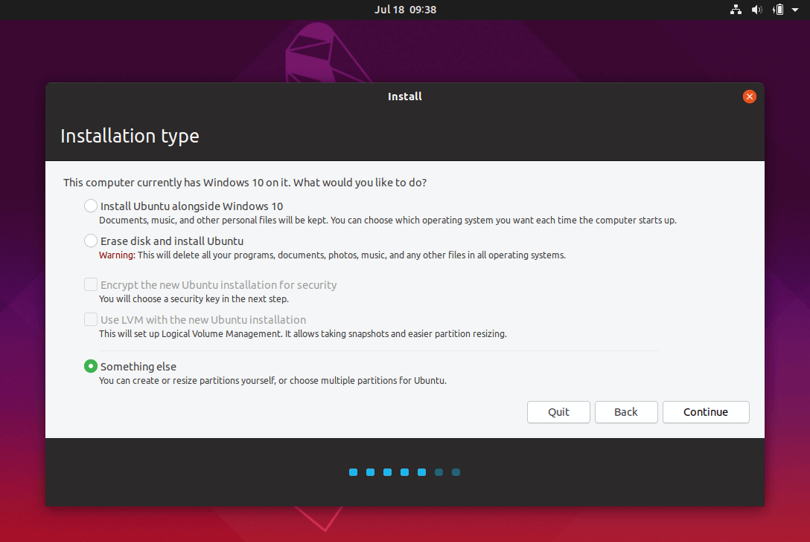
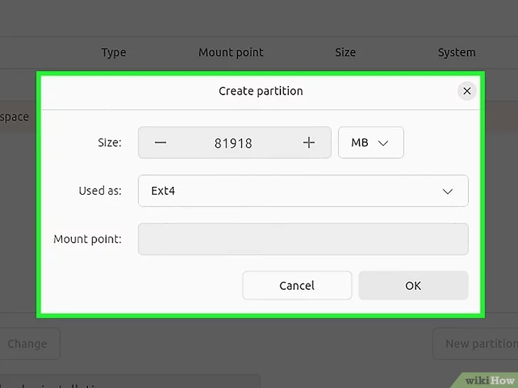
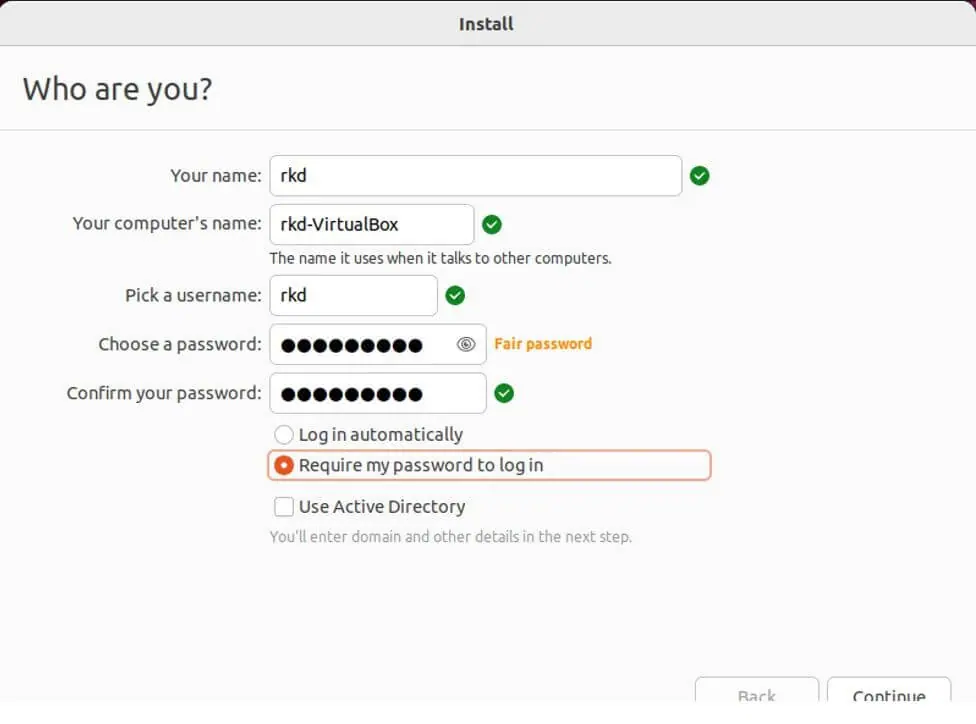

   
Before we start with the installation of Linux, let's first understand the basics of Operating system boot process.

### Boot Process

The boot process is the process by which a computer starts up and initializes the operating system on startup. The linux boot process consists of the following steps:

1. **System Startup/Hardware initialization:** The first step in the boot process is the system startup, which involves initializing the hardware components. The BIOS (Basic Input/Output System) or UEFI (Unified Extensible Firmware Interface) firmware is responsible for this step. It performs a power-on self-test (POST) to check the hardware components and then loads the bootloader. BIOS loads and executes the MBR boot loader.

2. **Bootloader stage 1:** The bootloader is a small program that loads the operating system. It is stored in the MBR (Master Boot Record) of the hard drive. It is located in the 1st sector of the bootable disk. Typically /dev/hda, or /dev/sda. MBR loads and executes the GRUB boot loader.
MBR is less than 512 bytes in size. This has three components 
 - primary boot loader info in 1st 446 bytes 
 - partition table info in next 64 bytes 
 - mbr validation check in last 2 bytes.

3. **Bootloader stage 2:**The bootloader stage 2 is responsible for loading the kernel. It is stored in the /boot directory of the hard drive.GRUB has the knowledge of the filesystem. If you have multiple kernel images installed on your system, you can choose which one to be executed.GRUB displays a splash screen, waits for few seconds, if you don’t enter anything, it loads the default kernel image as specified in the grub configuration file. GRUB has the knowledge of the filesystem (the older Linux loader LILO didn’t understand filesystem).  GRUB loads and executes Kernel and initrd images.

4. **Kernel:** Kernel executes the /sbin/init program.Since init was the 1st program to be executed by Linux Kernel, it has the process id (PID) of 1. Do a ‘ps -ef | grep init’ and check the pid.  The kernel is stored in the /boot directory of the hard drive.

5. **Init:** The init process is the first process that runs when Linux boots. It is responsible for starting all other processes on the system. The init process is stored in the /sbin directory of the hard drive. Init Looks at the /etc/inittab file to decide the Linux run level.
Following are the available run levels
* 0 – halt
* 1 – Single user mode
* 2 – Multiuser, without NFS
* 3 – Full multiuser mode
* 4 – unused
* 5 – X11
* 6 – reboot

6. **User Prompt:** Once the init process has started all other processes, it displays a user prompt on the screen. The user prompt is stored in the /bin directory of the hard drive.

### BIOS (Basic Input/Output System) and UEFI (Unified Extensible Firmware Interface) 
They are firmware interfaces that play a fundamental role in the boot process of a computer. They are responsible for initializing hardware components, performing a power-on self-test (POST), and starting the bootloader, which then loads the operating system. Below, I'll explain both BIOS and UEFI in detail:

Here's a table outlining the key differences between BIOS and UEFI:

| Feature                    | BIOS                        | UEFI                                |
|----------------------------|-----------------------------|-------------------------------------|
| **Definition**             | Legacy firmware interface   | Modern firmware interface           |
| **Storage Location**       | ROM (Read-Only Memory) chip | Flash memory (non-volatile) on the motherboard |
| **Boot Process**           | 16-bit real mode            | Supports both 32-bit and 64-bit modes |
| **Partitioning Scheme**    | MBR (Master Boot Record)    | GPT (GUID(Globally Unique Identifier) Partition Table) for larger drive support |
| **User Interface**         | Text-based                  | Graphical and text-based user interfaces |
| **Bootloader Support**     | Uses a Master Boot Record (MBR) and Legacy BIOS Boot Mode | Supports EFI bootloaders with an EFI System Partition (ESP) |
| **Hardware Initialization** | Basic hardware initialization | More extensive hardware initialization, including USB devices |
| **Legacy Support**         | Limited support for modern hardware | Full support for modern hardware and peripherals |
| **Boot Options**           | Limited boot options        | Enhanced boot options and a built-in boot manager |
| **Configuration**          | Accessed by function keys (e.g., F2, Del) during boot | Accessed via a graphical UEFI setup utility |
| **Updates**                | Firmware updates typically require a separate utility | Supports in-place firmware updates |
| **Secure Boot**            | Not supported               | Supports Secure Boot, which verifies bootloader and OS components |
| **Flexibility**            | Less extensible and feature-rich | More extensible with driver support, network capabilities, and pre-boot applications |
| **Partition Size Limits**  | Limited to 2.2 terabytes (MBR) | Supports larger hard drives and partitions |
| **Operating Systems**      | Compatible with older OSes designed for BIOS | Requires EFI-compatible operating systems |

While both BIOS and UEFI serve the same fundamental purpose of initializing hardware and booting the computer, UEFI offers several advantages, including greater hardware compatibility, support for larger drives, a user-friendly interface, and enhanced security features like Secure Boot. Many modern computers use UEFI firmware, but some provide legacy BIOS support for compatibility with older operating systems.

UEFI is considered a replacement for BIOS due to its improved capabilities, compatibility with modern hardware, and enhanced security features. Many newer computers come with UEFI firmware, although some still offer compatibility mode to boot using BIOS. The choice between BIOS and UEFI depends on the computer's hardware and the user's requirements.

### difference between LILO and GNU GRUB:

|Features | LILO | GNU GRUB |
|---------|------|----------|
|**Full Form**| Linux Loader | GNU GRand Unified Bootloader |
|**Bootloader Type**| Static | Dynamic |
|**Definition**|	A boot loader offered by the GNU project is called GRUB.|	It is a Linux bootloader that replaced loadlin as the default boot loader for most Linux OS in the years following its success.|
|**Introduction**|	It was introduced in 1995.|	Werner Almesberger was the first to introduce the LILO from 1992 to 1997.|
|**Supporting OS**|	It supports multiple OS, including Windows, macOS, Linux, Unix, BSD, and Solaris.|	It supports only a single operating system which is Linux OS.|
|**Complexity**	|It is more complex than LILO.	|It is simple and easy to use.|
|**GUI Menu Choice**|	It includes a GUI menu choice.|	It doesn't include a GUI menu choice.|
|**Development**|	It is developed by GNU Project.|	Werner Almesberger, John Coffman and Joachim Wiedorn are three developers that developed LILO.|
|**Type**	|It is a new default boot loader.	|It is an old default boot loader.|
|**Network Booting**|	It supports network booting.|	It doesn't support network booting.|

**Note:**
> BIOS (or UEFI): These are responsible for starting your computer, checking hardware, and finding the bootloader.

> LILO (or GNU GRUB): These are bootloaders that help load the Linux operating system after BIOS/UEFI. They let you choose which operating system or configuration to run at startup.

> Kernel: This is the core of the operating system. It manages the hardware, runs user programs, and maintains the overall security and integrity of the system.

> Init: This is the first process that runs when Linux boots. It is responsible for starting all other processes on the system.

> Runlevels: These are different modes of operation in Linux. Each runlevel has a different set of services or daemons that are started or stopped when the system enters a particular runlevel.

### Installing Linux
Installing a Linux operating system can vary slightly depending on the distribution (distro) you choose, but the general process remains consistent.
 Here's a step-by-step guide to installing a Linux OS on your computer:
**1. Choose a Linux Distribution:**
   - Select a Linux distribution (e.g., Ubuntu, Fedora, CentOS, Debian) that suits your needs. Consider factors such as your skill level, desktop environment preference, and intended use (desktop, server, development, etc.).

**2. Prepare Bootable Media:**
   - Download the ISO image of the Linux distribution you've chosen from the official website.
   - Create a bootable USB flash drive or DVD from the ISO image using a tool like Rufus (Windows) or dd (Linux).
   

**3. Back Up Your Data:**
   - Ensure you have a backup of any important data on your computer. The installation process may involve partitioning and formatting your hard drive.

**4. Insert Bootable Media:**
   - Insert the bootable USB drive or DVD into your computer's USB port or optical drive.

**5. Boot from the Installation Media:**
   - Restart your computer and access the BIOS/UEFI settings by pressing a specific key (e.g., F2, Del, Esc) during the boot process. The key varies depending on your computer's manufacturer.
   - In the BIOS/UEFI settings, change the boot order to prioritize the USB drive or DVD drive, depending on where you created the bootable media.
   - Save the changes and exit the BIOS/UEFI settings.

**6. Start the Installation:**
   - The computer should now boot from the installation media, and you'll see the Linux distribution's installation menu.
   - Select the "Install" option to begin the installation process.
   

**7. Select Language and Region:**
   - Choose your preferred language and region settings.
   

**8. Configure Keyboard Layout:**
   - Configure the keyboard layout based on your region and preferences.
  

**9. Configure Network Settings:**
   - If you're connected to the internet, you can configure network settings during the installation process.
   

**10. Choose Installation Type:**
   Select the installation type based on your preference:
   - **Erase Disk and Install Linux:** This option will erase the entire disk and install Linux as the sole operating system.
   - **Install Alongside Another OS:** If you have another operating system (e.g., Windows) installed, you can choose to install Linux alongside it.
   - **Something else:** Allows for manual partitioning and more advanced options.

**11. Partition the Disk (if applicable):**
   - If you selected the "Custom" or "Something Else" option, you'll need to create partitions for the Linux installation. This includes the root (/) partition, swap partition (recommended), and potentially a home (/home) partition.
   - Be cautious when partitioning, as it can affect your data. Backup important files before proceeding.
   

**12. Set User and Password:**
   - Create a user account with a username and password. This account will have administrative privileges.
   

**13. Complete the Installation:**
   - Follow the on-screen prompts to complete the installation. This may include selecting your time zone, configuring additional software (e.g., updates, third-party drivers), and reviewing installation settings.
   

**14. Reboot:**
   - Once the installation is complete, remove the installation media and reboot your computer. Now you can Log in using the user account credentials you created during installation

