### 5. **Monitoring System Performance:**
Monitoring system performance is crucial for ensuring that a Linux system is running efficiently and identifying potential issues. There are various tools available for monitoring system performance.

1. **top**:

   - `top` is a basic system monitoring tool that provides real-time information about CPU usage, memory utilization, and running processes.

   ```bash
   top
   ```

   - When you run `top`, you'll see a dynamic display of system statistics. Here's a sample output:

   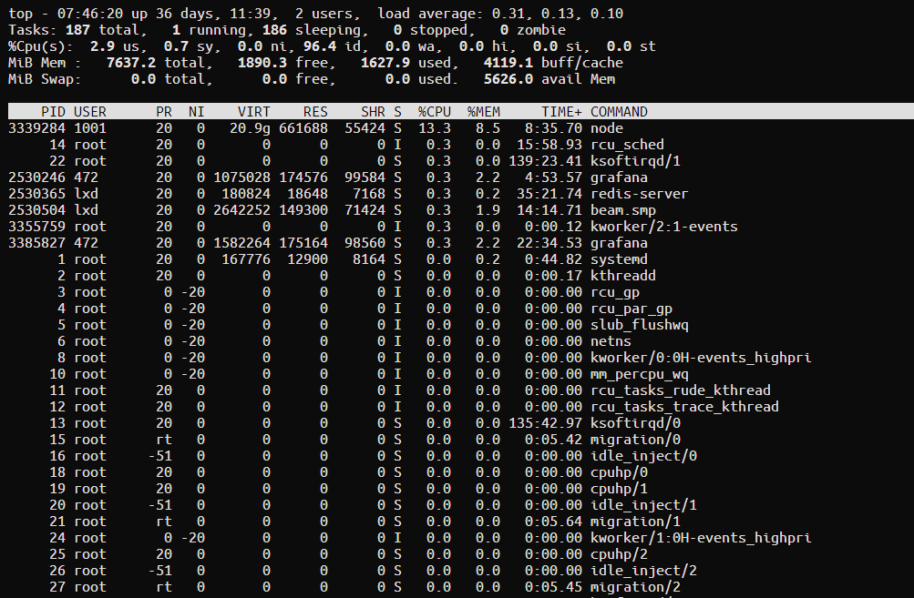

   - To exit `top`, press `q`.

2. **htop**:

   - `htop` is an improved version of `top` with a more user-friendly interface and additional features.

   ```bash
   sudo apt install htop  # Install if not already installed
   htop
   ```

   - `htop` provides a more visually appealing and customizable view of system performance. Sample output:

   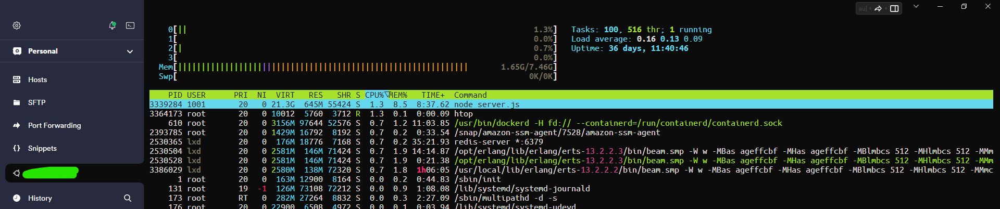

   - Press `F10` to exit `htop`.

3. **iotop**:

   - `iotop` focuses on monitoring disk I/O (input/output) activity, which can help identify processes that are using the disk heavily.

   ```bash
   sudo apt install iotop  # Install if not already installed
   iotop
   ```

   - `iotop` displays disk I/O statistics for running processes. Sample output:

   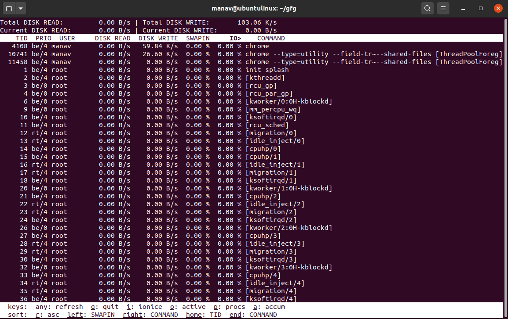

   - Press `q` to exit `iotop`.

4. **vmstat**:

   - `vmstat` provides information about system performance, including CPU, memory, and virtual memory statistics.

   ```bash
   vmstat 5
   ```

   - This command runs `vmstat` with a 5-second interval. Sample output:

   

   - Press `Ctrl+C` to stop `vmstat`.

5. **sar**:

   - `sar` (System Activity Reporter) collects, reports, and saves system activity information. It offers detailed historical data.

   ```bash
   sudo apt install sysstat  # Install if not already installed
   sar -u 5
   ```

   - This command runs `sar` with a 5-second interval and displays CPU utilization. Sample output:

   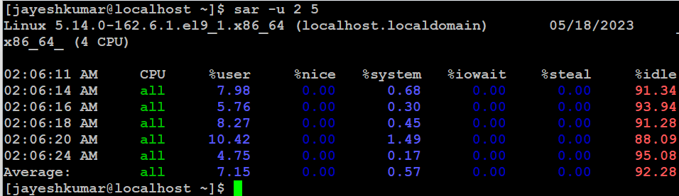

   - Press `Ctrl+C` to stop `sar`.


6. **lsof**
lsof short for "list open files," is a powerful command-line utility in the Linux and Unix operating systems. It provides information about files and directories that are currently opened or in use by processes running on the system. This tool is particularly helpful for system administrators, developers, and users who need to diagnose issues related to file access, identify resource leaks, or gain insights into the activities of running processes. Here are some key aspects of the `lsof` command:

Here's an example of how to use the `lsof` command:

   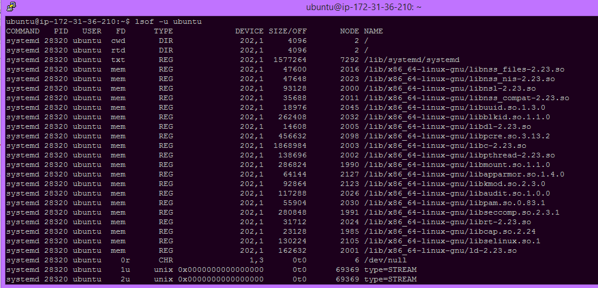

- To list all open files and network connections on your system, you can simply run:

  ```
  lsof
  ```

- To see which files a specific process with a known PID has opened:

  ```
  lsof -p <PID>
  ```

- To find all network connections on a specific port (e.g., port 80 for HTTP):

  ```
  lsof -i :80
  ```

- To list all open files for a particular user (replace `<username>` with the desired username):

  ```
  lsof -u <username>
  ```

7. **tcpdump**:

- `tcpdump` is a command-line packet analyzer for network traffic monitoring. It allows you to capture and display network packets on a system's network interface.

```bash
sudo apt install tcpdump  # Install if not already installed
sudo tcpdump -i eth0 -n
```

   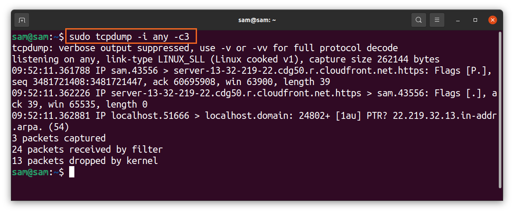
  
- The above command installs `tcpdump` if it's not already installed and starts capturing packets on the `eth0` network interface. The `-n` flag is used to display numeric IP addresses instead of resolving hostnames.

- `tcpdump` captures packets in real-time and displays detailed information about each packet, including source and destination IP addresses, port numbers, protocols, and payload data.

- You can filter the packets you capture by specifying various options. For example, to capture only HTTP traffic on port 80, you can use:

```bash
sudo tcpdump -i eth0 -n port 80
```

- To capture packets to or from a specific IP address, you can use:

```bash
sudo tcpdump -i eth0 -n host <IP_address>
```

- `tcpdump` is a versatile tool that can be used for various network troubleshooting and monitoring tasks, such as diagnosing network issues, analyzing network traffic, and detecting suspicious activity.

- Press `Ctrl+C` to stop capturing packets when you are done. `tcpdump` saves packet data in memory and can provide detailed information about network traffic patterns and issues.

8. **netstat**:

`netstat`, short for "network statistics," is a command-line utility that provides information about network connections, routing tables, network interfaces, and various network statistics on Unix-like operating systems, including Linux. It is a valuable tool for network administrators and users for diagnosing network-related issues and gaining insights into the system's network activities.

Here is an overview of how to use the `netstat` command and its capabilities:

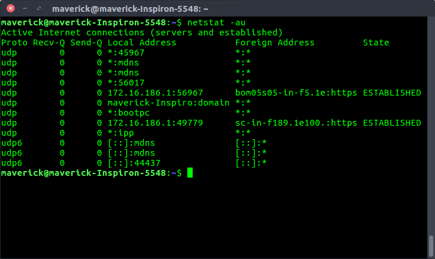
  
- **Displaying Network Statistics**:
   To view a list of active network connections and listening ports, you can use the following command:

   ```bash
   netstat -tuln
   ```

   - `-t` displays TCP connections.
   - `-u` displays UDP connections.
   - `-l` shows listening ports.
   - `-n` displays numerical addresses and ports.

- **Displaying Routing Information**:
   To see the kernel's routing table, use the following command:

   ```bash
   netstat -r
   ```

   This command displays information about the routing table, including the destination network, gateway, and network interface.

- **Displaying Network Interfaces**:
   To list network interfaces, their configurations, and statistics, use the following command:

   ```bash
   netstat -i
   ```

   This command provides information about the network interfaces, including input and output packets, errors, and more.

- **Displaying Network Groups**:
   To view information about multicast memberships, you can use the following command:

   ```bash
   netstat -g
   ```

   This command shows multicast group memberships.

- **Displaying Network Statistics over Time**:
   To monitor network statistics over time with a specified interval, you can use the following command:

   ```bash
   netstat -i 5
   ```

   This command displays network interface statistics every 5 seconds.

- **Filtering Output**:
   You can use various flags and options with `netstat` to filter and customize the output to suit your specific needs. For example, you can filter connections by protocol, address family, or specific ports.

- **Connection Information**:
   `netstat` provides information about network connections, including source and destination IP addresses, port numbers, protocol, and the current state of the connection.

`netstat` is a useful tool for diagnosing network issues, monitoring network activity, and gathering information about network-related parameters on a Unix-like system. However, please note that some of the functionality provided by `netstat` is being deprecated in favor of newer utilities like `ss` and `ip`. It's a good idea to familiarize yourself with these alternatives for more up-to-date network management tasks.

9. **iostat**:

`iostat` is a command-line tool in Unix-like operating systems, including Linux, that provides information about system input/output (I/O) statistics. It reports on the performance and utilization of various block devices, such as hard drives and SSDs, as well as CPU statistics. `iostat` is part of the sysstat package, and it is particularly useful for monitoring and diagnosing disk I/O performance issues. It provides insights into system bottlenecks, helps identify performance problems, and assists in optimizing I/O operations.

Here's an overview of how to use the `iostat` command:

   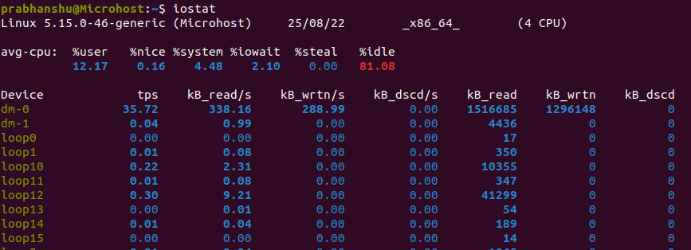
  
- **Basic Usage**:
   To run `iostat` and display a summary of CPU and I/O statistics, you can use the following command:

   ```bash
   iostat
   ```

   This command provides a snapshot of CPU utilization and disk I/O statistics for all available devices.

- **Specifying Device**:
   To focus on a specific device, you can use the `-d` flag followed by the device name. For example:

   ```bash
   iostat -d sda
   ```

   This command will display I/O statistics for the "sda" device.

- **Setting the Update Interval**:
   You can specify the update interval in seconds to continuously monitor the statistics. For example, to refresh the statistics every 2 seconds:

   ```bash
   iostat 2
   ```

- **Customizing Output**:
   `iostat` provides various options to customize the output, such as the ability to display in megabytes, kilobytes, or sectors per second. You can also specify the number of report iterations and more.

   ```bash
   iostat -dx 2 5
   ```

   In this example, the `-d` flag shows extended disk statistics, the `-x` flag displays statistics in sectors per second, and the command will run for 5 iterations with a 2-second interval.

- **Viewing CPU Statistics**:
   To view CPU statistics, you can use the `-c` flag:

   ```bash
   iostat -c 2 5
   ```

   This command will display CPU statistics over time, such as user, system, and idle percentages.

- **Disk Utilization and Load Analysis**:
   `iostat` helps you assess disk utilization and can be useful for identifying high load situations where the disk subsystem might be a bottleneck. Monitoring device utilization and service time can be crucial for identifying performance issues.

- **Resource Optimization**:
   By analyzing `iostat` output, you can optimize disk and CPU resource usage, identify I/O-bound applications, and make informed decisions to improve system performance.


10. **Monitorix**:

Monitorix is an open-source system monitoring tool designed to provide a comprehensive overview of a Linux server's performance and health. It gathers and visualizes various system statistics and resources, making it easier for administrators to monitor server performance, identify potential issues, and plan for resource optimization. Monitorix offers a web-based interface to view these statistics, making it convenient to access and analyze system data. Here's an overview of Monitorix:

   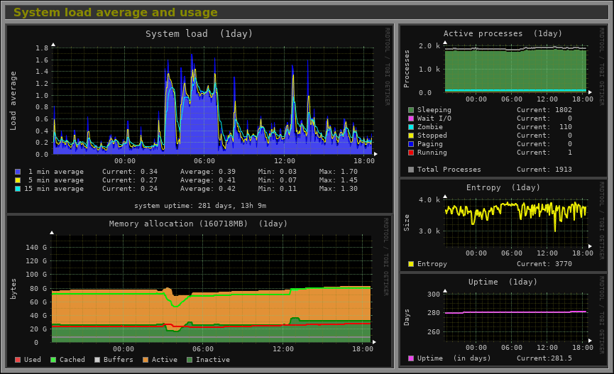
  
- **Installation**:
   Monitorix can usually be installed via your distribution's package manager. For example, on a Debian-based system:

   ```bash
   sudo apt install monitorix
   ```

   After installation, the Monitorix service starts automatically.

- **Web Interface**:
   Monitorix provides a web-based interface that you can access through a web browser. By default, you can access it at `http://localhost/monitorix`. You can configure the web server to allow access from other systems if needed.

- **Dashboard**:
   The Monitorix web interface presents a dashboard that displays real-time and historical data on various system parameters, such as CPU usage, memory consumption, disk activity, network traffic, system temperatures, and more.

- **Graphical Representation**:
   Monitorix utilizes graphical representations, such as line graphs and bar charts, to make it easy to visualize system metrics over time. You can customize which parameters are displayed on the dashboard.

- **Alerts and Notifications**:
   Monitorix supports the configuration of alerts and notifications. You can set up email notifications or execute custom scripts when certain thresholds are reached, which is essential for proactive system monitoring.

- **Extensibility**:
   Monitorix is extensible, allowing you to add custom modules and plugins for monitoring specific services or collecting additional metrics. This flexibility enables you to adapt Monitorix to your unique monitoring requirements.

- **Resource Usage Analysis**:
   Monitorix helps you analyze the usage of system resources, identify trends, and pinpoint potential performance bottlenecks. You can assess system health and detect any anomalies in resource consumption.

- **Historical Data**:
   Monitorix stores historical data for an extended period, enabling you to review long-term trends and analyze past performance.

- **Logging and Reporting**:
   Monitorix generates logs and reports, which can be helpful for auditing and tracking system performance over time. These reports are accessible through the web interface.

- **Resource-Specific Modules**:
    Monitorix includes modules for monitoring specific resources, like Apache, Nginx, MySQL, Postfix, and more. This can be beneficial for web server or database administrators.

11. **arpwatch**:

`arpwatch` is a network monitoring tool that keeps track of Ethernet traffic and maintains a database of Ethernet and IP address pairings, typically in the context of a local area network (LAN). It is used to detect and report changes in the ARP (Address Resolution Protocol) tables on a network, which can be indicative of network events or potential security threats. Here's an overview of `arpwatch`:
   
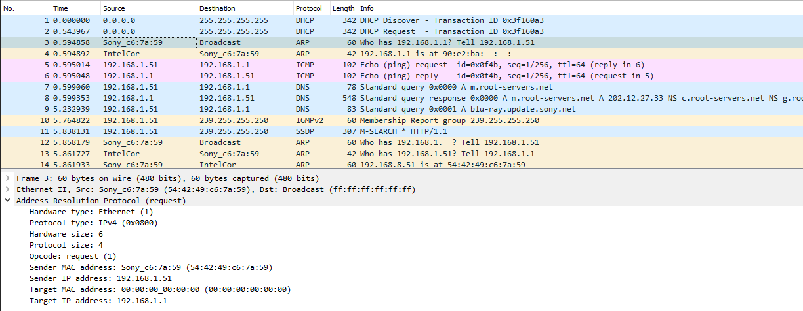

**Step 1: Installation**
Ensure that `arpwatch` is installed on your system. You can typically install it using your system's package manager. For example, on a Debian-based system:

```bash
sudo apt install arpwatch
```

**Step 2: Starting `arpwatch`**
After installation, `arpwatch` should start automatically. It monitors network traffic on your local network interface. To monitor changes in ARP tables for a specific network interface (e.g., eth0), you can run:

```bash
sudo arpwatch -i eth0
```

**Step 3: Simulate Network Change**
Let's simulate a network change by introducing a new device to the network. This could be a device connecting to your Wi-Fi or plugging into an Ethernet port.

**Step 4: Monitor `arpwatch` Output**
As the new device connects to the network, `arpwatch` will detect the change in the ARP table and generate a notification. You will see output similar to the following in your terminal:

```bash
eth0: new station 192.168.1.100 00:11:22:33:44:55
```

In this example:
- `eth0` is the network interface being monitored.
- `192.168.1.100` is the IP address of the new device.
- `00:11:22:33:44:55` is the MAC address of the new device.

`arpwatch` has detected the presence of the new device on the network and provided information about it. You can also check the log file generated by `arpwatch` for more details and a historical record of ARP changes.

12. **Monit**:

Monit is an open-source process supervision tool for Unix-like operating systems, including Linux. It is designed to monitor and manage various aspects of a system, such as processes, files, directories, and devices. Monit is widely used for automating system maintenance tasks and ensuring the availability and stability of services. Here's an overview of Monit:

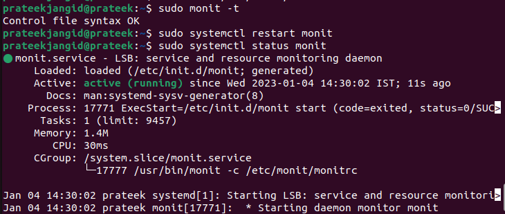


1. **Process Monitoring**:
   Monit can monitor processes on your system. If a process stops unexpectedly or misbehaves, Monit can automatically restart it. You can define which processes to monitor and set custom rules for actions like restarts.

2. **Service Monitoring**:
   Besides processes, Monit can monitor network services. This includes checking if a service is listening on a specific port and responding as expected. If a service fails, Monit can take predefined actions.

3. **File and Directory Monitoring**:
   Monit can monitor files and directories for changes, such as modifications, deletions, or the creation of new files. This can be useful for tracking important configuration files or log directories.

4. **Resource Monitoring**:
   You can set up Monit to monitor system resources, including CPU usage, memory consumption, and disk space. It can alert you or take actions if these resources exceed predefined thresholds.

5. **Event-Based Actions**:
   Monit can execute actions based on specific events. For example, you can configure it to send email notifications, run custom scripts, or restart services when certain conditions are met.

6. **Scheduling**:
   Monit operates on a predefined schedule, allowing you to set monitoring intervals and specify when to perform checks and take actions.

7. **Web Interface**:
   Monit provides a web-based interface for monitoring and managing your system. It allows you to view the status of monitored services and make configuration changes.

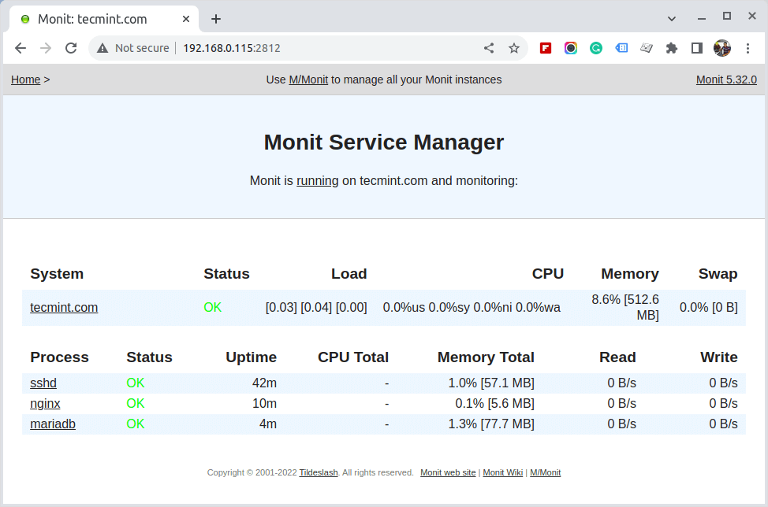


8. **Alerting and Notifications**:
   Monit can send alerts and notifications via email or other methods to inform administrators of issues or events.

9. **Logging and Reporting**:
   It maintains logs and generates reports, helping you track system changes and the results of monitoring activities.

10. **Configuration**:
    Monit's configuration is typically defined in a configuration file. You can customize the monitoring rules, actions, and thresholds according to your system's needs.

**Example Configuration**:

Here is a simplified example of Monit's configuration to monitor and automatically restart an important service (e.g., Nginx web server) if it becomes unresponsive:

```bash
check process nginx with pidfile /var/run/nginx.pid
  start program = "/etc/init.d/nginx start"
  stop program  = "/etc/init.d/nginx stop"
  if failed host 127.0.0.1 port 80 protocol http
    and request "/index.html"
    for 2 cycles then restart
```

In this example:
- Monit checks the Nginx process using the PID file.
- If the Nginx process fails to respond to an HTTP request to "http://127.0.0.1/index.html" for two consecutive cycles, Monit will automatically restart the Nginx service.


