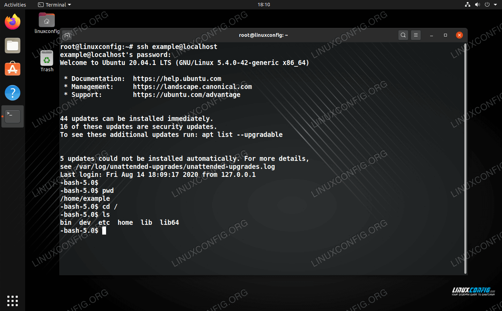

**Jail-Shell (Chroot Jails and Namespace Restriction):**

1. **Chroot Jails**: Chroot, short for "change root," is a Unix command that allows a process and its children to run with a different root directory. When used as a security mechanism, it isolates a process from the rest of the system, limiting its access to only a specific directory and its subdirectories.

2. **Namespaces**: Linux namespaces are a feature that allows the isolation of system resources, such as processes, network interfaces, and user IDs. They are commonly used in containerization technologies like Docker. By using namespaces, you can further restrict and isolate processes and user activities within the system.

3. **Security Isolation**: Jail-shell leverages both chroot and namespace technologies to create a secure environment for users. It restricts users to a specific directory and provides limited access to system resources, enhancing security by isolating user actions.

4. **Command and Directory Restrictions**: Users operating within the jail-shell environment are typically limited in terms of the commands they can execute and the directories they can access. This allows administrators to control and restrict user activities, reducing the risk of unauthorized actions.

5. **Customization**: The configuration of a jail-shell environment is highly customizable. System administrators can define which commands are allowed, which directories are accessible, and what other system resources are available within the restricted environment.

6. **Use Cases**: Jail-shell is often used in scenarios where there is a need to provide restricted access to a system for specific users or to isolate untrusted applications. It is common in shared hosting environments to isolate users from each other and from the host system.

7. **Security Benefits**: The use of jail-shell can enhance system security by reducing the attack surface and minimizing the potential damage that an exploited user account or application can cause. It can also help prevent unauthorized access to sensitive data and resources.




Creating a basic "jail-shell" environment in Ubuntu using chroot and namespace technologies can be a complex process, and it might not provide the same level of isolation as containerization technologies like Docker. However, I can provide a simplified guide to set up a chroot jail in Ubuntu. Please note that this guide is for educational purposes and is not a comprehensive security solution. 

**Prerequisites:**

1. You need root or sudo access to your Ubuntu system.
2. This example uses the Bash shell, but you can customize it for other shells.

**Step 1: Create a Directory for the Jail:**

Let's create a directory to serve as the jail's root. This is the directory to which you will restrict user access.

```bash
sudo mkdir /jail
```

**Step 2: Populate the Jail:**

You'll need to copy essential system binaries and libraries into the jail directory. The required binaries and libraries can vary depending on your specific use case. In this example, we'll include a minimal set.

```bash
sudo cp -v /bin/bash /jail/bin/
sudo cp -v /lib/x86_64-linux-gnu/libtinfo.so.5 /jail/lib/x86_64-linux-gnu/
```

You may need to copy additional libraries depending on the commands you want to make available inside the jail.

**Step 3: Create a User:**

Create a user who will be jailed in the environment. This user's home directory should be set to the jail's directory. In this example, the username is "jaileduser," and the jail directory is "/jail."

```bash
sudo useradd -m -d /jail jaileduser
```

**Step 4: Set a Password for the User:**

Set a password for the jailed user.

```bash
sudo passwd jaileduser
```

**Step 5: Create a Jail Configuration:**

Create a script that will launch the chroot jail with the desired settings. For instance, create a script called `/jail/chroot.sh` with the following content:

```bash
#!/bin/bash
chroot /jail /bin/bash
```

Make the script executable:

```bash
sudo chmod +x /jail/chroot.sh
```

**Step 6: Allow SSH Access:**

If you want to allow SSH access to the jailed environment, you can configure it in `/etc/ssh/sshd_config`. Add or modify the following lines:

```plaintext
Match User jaileduser
    ChrootDirectory /jail
```

Then restart the SSH service:

```bash
sudo systemctl restart ssh
```

**Step 7: Test the Jail:**

As the jailed user, you can access the jail by running the chroot script:

```bash
sudo -u jaileduser /jail/chroot.sh
```

