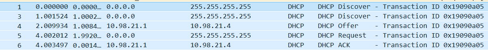
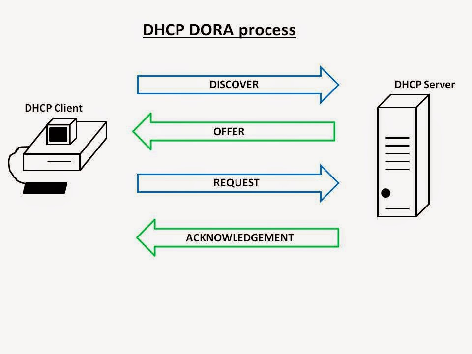

**Dynamic Host Configuration Protocol (DHCP)** is a network protocol that automates the process of assigning IP addresses and other network configuration settings to devices (computers, smartphones, printers, etc.) on a TCP/IP-based network. DHCP simplifies network administration by managing the allocation of IP addresses and related information, making it easier to add and manage devices on a network.

### DHCP Overview

1. **IP Address Allocation**:
   DHCP primarily focuses on the dynamic allocation of IP addresses. When a device (referred to as a DHCP client) joins a network, it typically doesn't have a static IP address assigned. Instead, it sends a DHCP request to the DHCP server, requesting an IP address.

2. **DHCP Server**:
   The DHCP server is a central component responsible for managing and distributing IP addresses and configuration parameters. It stores a pool of available IP addresses and assigns them to clients as needed.

3. **DHCP Client**:
   Any device that requires network connectivity and supports DHCP is a DHCP client. Common DHCP clients include computers, smartphones, tablets, and IoT devices. When a DHCP client connects to a network, it automatically seeks out a DHCP server to obtain its network configuration.

4. **DHCP Lease**:
   When a DHCP client requests an IP address, the DHCP server assigns it a lease. A lease is a time-limited agreement that specifies how long the client can use the assigned IP address. After the lease duration expires, the client must renew the lease to continue using the IP address.

5. **IP Address Reservation**:
   DHCP allows for static IP address assignments, where specific devices are assigned the same IP address every time they connect to the network. This is useful for servers and network devices that need consistent IP addresses. DHCP servers can reserve specific IP addresses for particular clients based on their hardware (MAC) address.

6. **Configuration Parameters**:
   In addition to IP addresses, DHCP servers can provide other network configuration parameters to clients. Common parameters include:

   - Subnet mask: Defines the network's address range.
   - Default gateway: Specifies the router's IP address for reaching other networks.
   - DNS server(s): Provides the IP addresses of DNS servers for name resolution.
   - Domain name: Specifies the local domain name for the network.
   - Lease time: Sets the duration for which the IP address is valid.

7. **DHCP Message Exchange**:
   
   DHCP communication follows a standard message exchange process which is called dora process. The DORA process is a four-step process that involves the following messages:

   - **Discover**: When a DHCP client connects to the network or needs to renew its lease, it sends a DHCP Discover message to the broadcast address. It's essentially saying, "Is there a DHCP server available?"
   - **Offer**: If a DHCP server is available, it responds with a DHCP Offer message, offering an IP address and configuration details.
   - **Request**: The client acknowledges the offer by sending a DHCP Request message, indicating which IP address it accepts.
   - **Acknowledge**: Upon receiving the Request, the DHCP server sends a DHCP Acknowledgment message, finalizing the lease and confirming the configuration parameters.

8. **Lease Renewal**:
   As the lease expiration approaches, the DHCP client attempts to renew the lease with the original DHCP server. If successful, the lease is extended. If the DHCP server that initially assigned the lease is unavailable, the client can seek renewal from any DHCP server on the network.

9. **Scalability and Load Balancing**:
   Large networks may deploy multiple DHCP servers for redundancy and load balancing. These servers coordinate to ensure IP address allocation while distributing the load.

10. **Troubleshooting**:
    DHCP-related issues, such as IP address conflicts or failed leases, can impact network connectivity. Troubleshooting often involves checking DHCP server logs, examining client configurations, and ensuring DHCP server availability.

### Dora Process

The DORA process in the context of networking and DHCP (Dynamic Host Configuration Protocol) stands for "Discover, Offer, Request, and Acknowledge." It is the sequence of messages exchanged between a DHCP client (the device seeking an IP address) and a DHCP server (the device responsible for assigning IP addresses) during the IP address allocation process. Each step in the DORA process serves a specific purpose:

1. **Discover (D)**:

   - **Client Action**: The DHCP client initiates the process when it connects to a network and needs an IP address. It broadcasts a DHCP Discover message on the local network.
   - **Server Action**: DHCP servers on the network listen for DHCP Discover messages. When a DHCP server receives a Discover message, it checks its configuration to determine whether it can offer an IP address to the client.

2. **Offer (O)**:

   - **Client Action**: After receiving the DHCP Discover message, a DHCP server that can provide an IP address sends a DHCP Offer message to the client. This message includes an IP address, subnet mask, lease duration, and other network configuration parameters.
   - **Server Action**: The DHCP server reserves the offered IP address for the client and records this in its lease database. If multiple DHCP servers are available, the client may receive multiple offers but will choose one.

3. **Request (R)**:

   - **Client Action**: The DHCP client selects one of the offered IP addresses (typically the first one received) and sends a DHCP Request message to the offering server, requesting the use of that IP address.
   - **Server Action**: The DHCP server that receives the Request message confirms the assignment of the requested IP address and acknowledges it. If the DHCP server has a record of the lease, it marks it as in use. If the requested IP address is no longer available (due to conflict or lease expiration), the server responds with a NAK (Negative Acknowledgment) message.

4. **Acknowledge (A)**:
   - **Client Action**: Upon receiving a DHCP Acknowledgment message from the server, the client knows it has been granted the requested IP address. It configures its network interface with the provided IP address and other configuration settings.
   - **Server Action**: The DHCP server acknowledges the client's request and completes the lease assignment process. It records the lease in its database with the client's MAC address and the assigned IP address.
