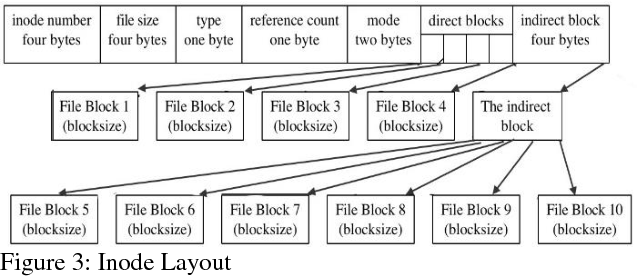
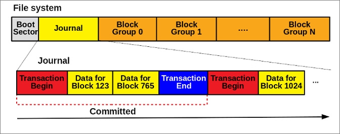
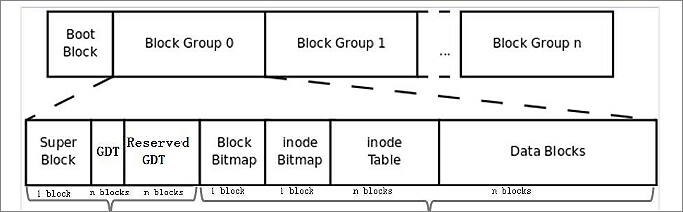

## 3.File systems

File systems are essential components of any operating system, as they dictate how data is stored, organized, and accessed on storage devices such as hard drives and SSDs. FAT (File Allocation Table), NTFS (New Technology File System), and EXT (Extended File System) are three different file systems used primarily on various operating systems.

Here's a detailed explanation of each:

### 1. FAT (File Allocation Table):

   - **History:** FAT was initially introduced by Microsoft in 1977 as a simple file system for floppy disks. Over the years, it evolved into various versions like FAT12, FAT16, and FAT32 to accommodate larger storage devices.

   - **Structure:**
     The File Allocation Table (FAT) has a simple and straightforward structure. It consists of a sequence of entries, with each entry representing a cluster on the disk. A cluster is a group of contiguous sectors, which is the smallest unit of disk space that can be allocated to a file. Each entry in the FAT contains information about the status of the corresponding cluster, such as whether it is free or allocated to a file. The entries also contain pointers to the next cluster in a file, allowing the FAT to keep track of the sequence of clusters that make up a file. The first entry in the FAT is reserved for the root directory of the disk, while the remaining entries are used for file and directory clusters.
     FAT file systems consist of three main components: the boot sector, the file allocation table (FAT), and the root directory.

     - The boot sector contains essential information about the file system and the location of the FAT.
       
     - The FAT is a table that keeps track of each cluster's status on the storage device, indicating whether a cluster is free or occupied.
     - The root directory is a fixed-size directory that contains information about the files and directories stored in the root of the drive.

   - **Advantages:**

     - Simplicity: FAT is straightforward and easy to implement, making it suitable for devices with limited processing power.
     - Cross-Compatibility: FAT is compatible with various operating systems, including Windows, macOS, Linux, and many other platforms.

   - **Disadvantages:**

     - Limited Features: FAT lacks advanced features like journaling, file permissions, and encryption.
     - Limited File Size and Volume Size: Older versions of FAT (FAT16 and FAT12) have limitations on file and volume sizes.
     - Poor Reliability: FAT file systems are more prone to data corruption and fragmentation, which can lead to data loss.

   - **Use Cases:** FAT file systems are commonly used in USB drives, memory cards, and other portable storage devices due to their compatibility with various devices and operating systems. However, FAT32 is still used for small partitions where simplicity and compatibility are more important than advanced features.

**Types of File Allocation Table(FAT)**
There are three main types of File Allocation Table (FAT) file systems: FAT12, FAT16, and FAT32.

- **FAT12** was the original version of the FAT file system, which was first introduced in 1980 with MSDOS. It was designed for small disks, with a maximum size of 16MB and a cluster size of 512 bytes. FAT12 is no longer commonly used, but it can still be found on some older devices such as digital cameras and music players.

- **FAT16** was the next version of the FAT file system, which was introduced in 1984 with the release of MS-DOS 3.0. It supports larger disks than FAT12, with a maximum size of 2GB and a cluster size of up to 64KB. FAT16 is still used on some devices, but it is not as common as it used to be.

- **FAT32** is the most recent version of the FAT file system, which was introduced in 1996 with the release of Windows 95 OSR2. It was designed to support larger disks than FAT16, with a maximum size of 2TB and a cluster size of up to 32KB. FAT32 is still widely used today, particularly on removable storage devices such as USB drives and SD cards.

### 2. NTFS (New Technology File System):

- **History:** NTFS was introduced by Microsoft in 1993 as a replacement for the aging FAT file systems. It was designed to address the limitations of FAT and provide advanced features.

- **Structure:**

  - NTFS is a more complex file system with features like journaling, file compression, encryption, and file permissions.
  - It uses a Master File Table (MFT) to store metadata about files and directories, which enhances performance and reliability.

- **Advantages:**

  - Reliability: NTFS includes journaling, which helps prevent data corruption and simplifies recovery after unexpected system crashes or power failures.
  - Scalability: NTFS supports large file sizes and volumes, making it suitable for modern storage needs.
  - Advanced Features: Features like encryption, file compression, and access control make it suitable for business and enterprise environments.
  - Improved Performance: The MFT structure enhances file access and storage efficiency.

- **Disadvantages:**

  - Compatibility: NTFS is primarily used in Windows environments and may have limited compatibility with non-Windows systems.
  - Overhead: NTFS's advanced features can consume more storage space and system resources compared to simpler file systems.

- **Use Cases:** NTFS is the default file system for modern Windows operating systems and is widely used in corporate environments, servers, and personal computers.

### 3. EXT (Extended File System):

   - **History:** The EXT file system family is commonly associated with the Linux operating system. It has evolved over time, with versions like EXT2, EXT3, and EXT4.

   - **Structure:**

     - EXT file systems use block groups to organize data efficiently and keep track of file metadata.
     - They support features like journaling, which improves data integrity and recovery.

   - **Advantages:**

     - Performance: EXT4, the most widely used version, offers excellent performance, making it suitable for both desktop and server use.
     - Journaling: Journaling helps maintain file system consistency in case of unexpected shutdowns.
     - Extensibility: EXT4 can support very large file sizes and volumes.
     - Open Source: Being open source, EXT file systems are well-documented and continuously improved by the Linux community.

   - **Disadvantages:**

     - Limited Compatibility: EXT file systems are primarily used in Linux environments and may not be easily readable by other operating systems.
     - Less Advanced Features: While EXT4 is feature-rich, it may not offer the same level of advanced features as NTFS in Windows environments.

   - **Use Cases:** EXT file systems are the default choice for most Linux distributions, making them suitable for Linux desktops, servers, and embedded systems.

- **Types of EXT file system**
  There are three main types of EXT file systems: EXT2, EXT3, and EXT4.

- **EXT2** defined as a second extended file system, was the first version of the EXT file system, which was introduced in 1993. It was designed to address the limitations of the MINIX file system, which was the default file system in early versions of Linux. EXT2 supports large file sizes and volumes, but it lacks advanced features like journaling.The individual file size that Ext2 supports is 2TB and can be from 4TB to 32 TB depending upon block size.
  

- **EXT3** defined as a third extended file system, was the next version of the EXT file system, which was introduced in 2001. It was designed to address the limitations of EXT2 and provide journaling support. This file journaling system is used on multiple Linux distributions. It can track all the changes made with Ext3 to improve reliability and reduce possible file system corruption. In addition, it allows you to upgrade from Ext2 without the need to back up and restore data. EXT3 is still widely used today, but it has been superseded by EXT4.
  
- **EXT4** is the most recent version of the EXT file system, which was introduced in 2008. It was designed to address the limitations of EXT3 and provide better performance and scalability. EXT4 is the default file system for most Linux distributions today.
  

In summary, the choice of file system depends on the specific requirements of the operating system and the use case. FAT is suitable for simple cross-platform compatibility, NTFS offers advanced features and reliability for Windows environments, and EXT is the go-to choice for Linux-based systems. Each has its strengths and weaknesses, making them appropriate for different scenarios.
